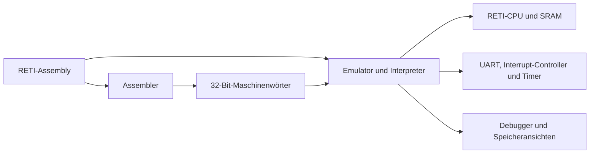
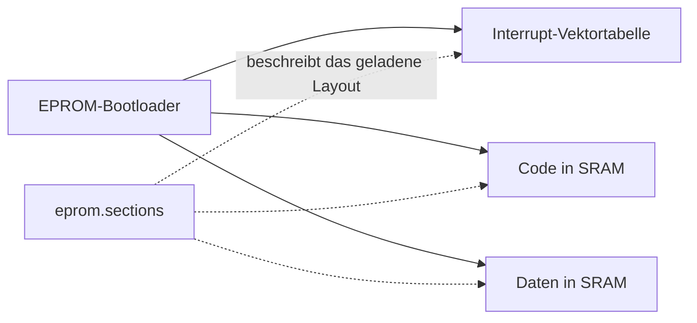
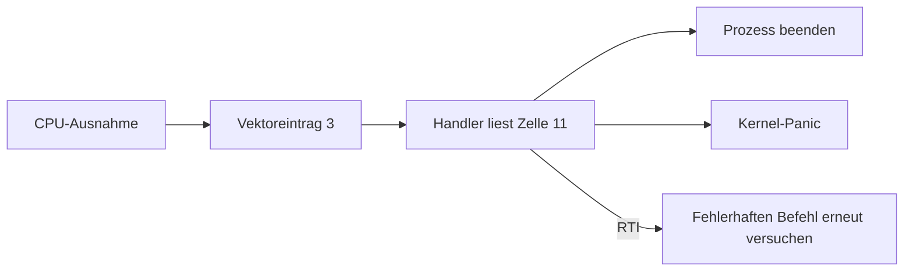
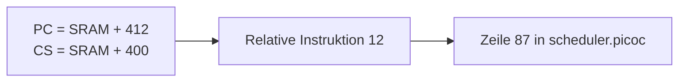
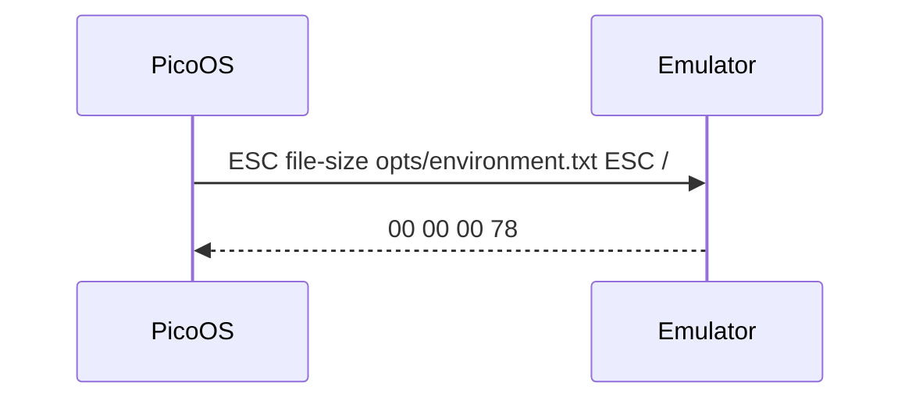

[](https://asciinema.org/a/693086)

# Was ist der RETI-Emulator?

Eigentlich ist der RETI-Emulator ein **RETI-Emulator**, **RETI-Assembler**, **RETI-Debugger** und **Visualizer** für die Speicherinhalte der Peripheriegeräte der RETI während der Ausführung

- **Interpreter:** Ein Interpreter führt Anweisungen einer Programmiersprache direkt aus, ohne sie vorher in Maschinencode zu übersetzen. Die Ausführung erfolgt zeilenweise oder schrittweise.
  - *Beispiel:* Python-Interpreter.
- **Assembler:** Ein Assembler übersetzt Code in Assemblersprache in ausführbaren Maschinencode, der von einer dafür spezfischen CPU verstanden wird.
  - *Beispiel:* Übersetzung von MOV AX, BX in Maschinencode für eine spezifische Architektur.
- **Emulator:** Ein Emulator ahmt die Funktionalität eines Systems (z.B. Hardware oder Software) nach, sodass Programme für das originale System unverändert darauf laufen können.
  - *Beispiele:* QEMU, der die Funktionalität verschiedener CPU-Architekturen nachahmt oder SNES-Emulatoren, welche alte Konsolenspiele auf einem PC ausführen.
- **Debugger:** Ein Debugger ist ein Tool, das die Ausführung eines Programms erlaubt, mit dem Ziel Fehler (Bugs) zu finden, zu analysieren und zu beheben. Es bietet Funktionen wie Breakpoints, Schritt-für-Schritt-Ausführung und Inspektion von Variablen, Registerwerten und Speicherbereichen. Das Programm kann in verschiedenen Formen spezifiziert sein, einschließlich Quellcode, Bytecode oder ausführbarem Maschinencode.
  - *Beispiel:* GDB (GNU Debugger) für C/C++-Programme.
- **Visualizer:** Ein Visualizer stellt Daten, Abläufe oder Systeme visuell dar, um deren Struktur, Verhalten oder Ergebnisse leichter verständlich zu machen.
  - *Beispiel:* Ein Graph-Visualizer, der Knoten und Verbindungen eines Netzwerks grafisch darstellt.
- **Simulator:** Ein Simulator modelliert ein System oder dessen Verhalten auf höherer Abstraktionsebene, um Analysen, Tests oder Training durchzuführen, ohne jede Funktionalität notwendigerweise exakt nachzubilden.
  - *Beispiel:* Flugsimulator für Pilotentraining.

Der RETI-Emulators hat einmal das Ziel, dass darauf eines Tages ein minimales Betriebssystem läuft, dass in PicoC geschrieben ist. Ein weiteres Ziel des RETI-Emulators ist es im Übungsbetrieb die Studenten beim Schreiben von RETI Programmen zu unterstützen, daher zeigt der RETI-Emulator auch Fehlermeldungen an und hat einen stärkeren Fokus auf Bugtesting und Features, welche die Verwendung für Studenten angenehmer gestalten.



# Übersicht

## Kommandozeilenoptionen

- `-r ram_size`: Setzt die Anzahl adressierbarer 32-Bit-Wörter im SRAM (Stadardwert: `2^16=65536`)
- `-d`: Zeigt das Ncurses Debug TUI an
- `-K`: Hält die Debug-TUI nach dem abschließenden `JUMP 0` geöffnet, bis sie mit `q` beendet wird
- `-f file_dir`: Gibt an, wo das Verzeichnis `.reti_emulaor` erzeugt werden soll
- `-e eprom_prgrm_path`: Parst und lädt Eprom-Startprogramm aus Datei, die über Dateipfad gefunden werden kann
- `-i isrs_prgrm_path`: Parst und lädt Interrupt-Service Routinen aus Datei, die über Dateipfad gefunden werden kann
- `-C interrupt_controller_config_path`: Initialisiert die Zuordnung und Priorität der Hardware-Interrupts aus einer Konfigurationsdatei
- `-n isr_count`, `--isr-count isr_count`: Setzt die Anzahl der Einträge in der Interrupt-Vektor-Tabelle explizit auf einen Wert zwischen `0` und `255`
- `-S sections_path`: Verwendet die angegebene `.sections`-Datei anstelle von `<program>.sections`
- `-D debuginfo_path`: Verwendet die angegebene `.debuginfo`-Datei anstelle von `<program>.debuginfo`
- `-w max_waiting_instrs`: Setzt raximale Wartezeit der UART für das Senden und Empfangen von Daten (Anzahle Befehle)
- `-t`: Aktiviert Testmode für Systemtests
- `-m`: Liest Eingaben aus Kommentar `# input: ...` raus
- `-c`: Zeigt Quellkommentare im Debugmode an
- `-v`: Zeigt zusäztliche Informationen an (Welche Kommandozeilenoptionen aktiviert sind)
- `-b`: Aktiviert die Darstellung von Dezimalzahlen in Binärdarstellung
- `-E`: Aktiviere Erweiterte Funktionalitäten (Hilfslinien um unnötige Leerzeichen sichtbar zu machen)
- `-a`, `--assemble`: Assembliert die `.reti`-Datei in eine gleichnamige `.bin`-Datei und schreibt zuerst `codesegment_start`, `datasegment_start`, `heap_start`, `heap_size` und `stack_start` aus der gleichnamigen `.sections`-Datei, danach die Maschinenwörter binär kodiert wie in `sram.bin`
- `-u`: Wertet Werte im Datensegment in Zweierkomplementdarstellung oder Betrag-Vorzeichendarstellug aus
- `-I timer_interrupt_interval`: Das Zeitinterval (Anzahl ausgeführte Befehle) zwischen Timer Interrupts; `0` deaktiviert den Timer Interrupt
- `-O`: Startet mit einer synthetischen aktiven ISR für Betriebssysteme, deren erster Prozess per `RTI` gestartet wird
- `-h`: Zeigt Verwendungshinweise an

<!-- - `-p page_size`: Setzt Seitengröße (Standardwert: `2^12=4096`) -->
<!-- - `-r radius`: Setzt Radius an Speicherzellen, die in der Legacy Debug TUI um einen observierten Addresspointer herum angezeigt werden sollen -->
<!-- - `-l`: Zeigt das Legacy Debug Interface anstelle -->

## TUI-Aktionen

Die Infobox verteilt die Aktionen auf drei Seiten. Mit `o` wird zyklisch zur nächsten Seite gewechselt.


| Taste | Aktion |
| --- | --- |
| `n` | Nächsten Befehl ausführen |
| `c` | Bis zum nächsten Breakpoint `INT 3` weiterlaufen |
| `E` | Kontinuierliche Ausführung unterbrechen und zum schrittweisen Debuggen zurückkehren |
| `r` | Programm mit denselben Argumenten neu starten |
| `s` / `f` | ISR betreten / abschließen |
| `Tab` / `Shift-Tab` | Nächstes / vorheriges TUI-Fenster auswählen |
| `j` / `k` | Im ausgewählten Adressfenster scrollen |
| `J` / `K` | Beobachtete Adresse oder beobachteten Registerwert erhöhen / verringern |
| `C` | Ansicht wieder auf das Watchobject zentrieren |
| `a` | Watchobject einem Register oder einer Adresse zuweisen |
| `A` | Ausgewählten Register- oder Speicherwert ändern |
| `T` / `e` | Ausgewählte ISR auslösen / nächste manuell auslösbare ISR auswählen |
| `S` / `R` | Snapshot speichern / wiederherstellen |
| `d` | PicoC-Quellcodeansicht öffnen |
| `t` | Sichtbare SRAM-Werte zwischen Zahl, RETI-Instruktion und ASCII transkodieren |
| `v` | UART-Terminalansicht öffnen; `Escape` kehrt zur Debug-TUI zurück |
| `V` | Rohe UART-Terminalansicht öffnen; `Ctrl+]` kehrt zur Debug-TUI zurück |
| `q` | Menü oder Emulator verlassen |

# Installation und Updates

## Installation auf Linux Systemen, auf denen Kompilierung nicht möglich ist über eine statische Binary

```bash
$ git clone -b main https://github.com/matthejue/RETI-Emulator.git ~/RETI-Emulator --depth 1
$ cd ~/RETI-Emulator
$ make install-linux-local
```

## Installation auf Linux Systemen, auf denen Kompilierung möglich ist durch eben Kompilierung

```bash
$ git clone -b main https://github.com/matthejue/RETI-Emulator.git ~/RETI-Emulator --depth 1
$ cd ~/RETI-Emulator
$ make install-linux-global
```

## Deinstallation auf Linux Systemen, wenn vorher lokal installiert wurde

```bash
$ cd ~/RETI-Emulator
$ make uninstall-linux-local
```

## Deinstallation auf Linux Systemen, wenn vorher global installiert wurde

```bash
$ cd ~/RETI-Emulator
$ make uninstall-linux-global
```

## Updaten auf Linux Systemen, wenn vorher lokal installiert wurde

```bash
$ cd ~/RETI-Emulator
$ make update-linux-local
```

## Updaten auf Linux Systemen, wenn vorher global installiert wurde

```bash
$ cd ~/RETI-Emulator
$ make update-linux-global
```

> Bitte lokale und globale Installationen nicht mischen, beim Wechsel zur jeweils anderen Installationsart vorher eine Deinstallation für die zuvor verwendete Installationsart durchführen.


# Verwendung

Der RETI-Emulator ist dazu in der Lage, die RETI-Befehle eines in einer `.reti`-Datei angebenen RETI-Programms zu interpretieren. D.h. er kann das RETI-Programm **ausführen**, indem er die RETI-Befehle aus einer Datei `prgrm.reti` herausliest und in den simulierten SRAM schreibt und mithilfe eines autogenerierten EPROM-Startprogramms, dass zu Beginn ausgeführt wird an den Start dieses Programmes springt. Zum Ausführen eines Programmes muss der RETI-Emulator mit dem Pfad zum RETI-Programm als Argument aufgerufen werden, z.B.:

```bash
$ reti_emulator ./prgrm.reti
```

Ohne `-d` erscheinen abgeschlossene UART-Sendungen als rohe Bytes auf `stdout` und können wie gewohnt umgeleitet werden:

```bash
$ reti_emulator ./prgrm.reti > ausgabe.txt
```

Das RETI-Programm `prgrm.reti`, das im Folgenden als Beispiel verwendet wird, sieht dabei wie folgt aus:

```reti
# input: 16909060 3
INT 3 # just a breakpoint, use c in debug mode -d to directly jump here
INT 2
MOVE ACC IN1
INT 2
MULT ACC IN1
INT 3
INT 0
JUMP 0
```

> Nicht vergessen `JUMP 0` ans Ende des Programmes zu setzen, sonst wird einfach weiter ausgeführt was danach im SRAM steht bzw. als was für Instructions der Speicherinhalt auf den der `PC` in dem Moment zeigt interpretiert wird.

RETI-Emulator speichert alle Memory-Inhalte des SRAM in einer Datei `.reti_emulaor/sram.bin` ab. Die aus der Datei `prgrm.reti` geparsten Assembly-Befehle werden realitätsgetreu als 32-Bit (4 Byte) Maschinenbefehle in dieser Datei abgespeichert, weil dies am speichereffizientesten ist und die RETI möglichst realistisch simuliert werden soll.

> Die Datei `.reti_emulaor/sram.bin` ist zwar in der Ausgabe von `$ ls -lh ./.reti_emulaor/sram.bin` 256KB groß (mit dem default Wert von `-r 65536`, also $2^{16}$), aber in Wirklichkeit verbraucht die Datei bei einem kleinen RETI-Programm nur wenige KibiBytes, weil Sparse Files verwendet werden. Das sieht man z.B. mit `$ du -h ./.reti_emulaor/sram.bin`.

> *Tipp:* Mittels `-f /tmp` (files) wird `.reti_emulaor` unter `/tmp` erstellt. Das Verzeichnis `/tmp` ist häufig als **tmpfs**-Partition, welche im Arbeitsspeicher gemounted ist umgesetzt. Dadurch existiert der Inhalt des Verzeichnisses nach dem Herunterfahren nicht mehr und das Verzeichnis, in dem der RETI-Emulator ausgeführt wird, wird nicht mit unnützen Dateien vollgemüllt.

## Direkte Speicherwerte in `.reti`-Dateien

Neben RETI-Instruktionen können in einer `.reti`-Datei auch direkte Speicherwerte stehen. Solche Werte werden nicht assembliert, sondern unverändert als 32-Bit-Wort in die nächste SRAM-Zelle geschrieben.

Unterstützt werden dezimale Zahlen und einzelne ASCII-Zeichen in einfachen Anführungszeichen:

```reti
LOADI ACC 1
42
-1
'e'
'!'
JUMP 0
```

In diesem Beispiel werden `42`, `-1`, der ASCII-Wert von `e` (`101`) und der ASCII-Wert von `!` (`33`) direkt in aufeinanderfolgende Speicherzellen geschrieben. Das ist besonders nützlich für Datensegmente, Strings oder vom Compiler erzeugte Speicherinhalte, die nicht als RETI-Instruktionen interpretiert werden sollen.

## Abschnittsdateien für Compiler-Ausgaben

Wenn zu einer Datei `program.reti` eine Datei `program.sections` existiert, liest der Emulator diese JSON-Datei ein und verwendet sie, um die `.reti`-Datei in Interrupt-Service-Routinen, Codesegment und Datensegment aufzuteilen. Mit `-S sections_path` kann stattdessen eine Abschnittsdatei mit anderem Pfad angegeben werden.

Beispiel für `program.sections`:

```json
{
  "interrupt_service_routines_start": 4,
  "codesegment_start": 40,
  "datasegment_start": 180,
  "heap_start": 400,
  "heap_size": -1,
  "stack_start": 8000
}
```

Die Adressen sind nullbasiert und beziehen sich auf die geparsten Speicherwörter bzw. Instruktionen der `.reti`-Datei:

| SRAM-relativer Bereich | Inhalt |
| --- | --- |
| `0..3` | Rohe Einträge der Interrupt-Vektor-Tabelle |
| `4..39` | Interrupt-Service-Routinen |
| `40..179` | Codesegment |
| `180..end` | Rohe Wörter des Datensegments |

Das Codesegment wird wie normale RETI-Instruktionen angezeigt. Das Datensegment wird als rohe Speicherwerte angezeigt, also werden die Inhalte dort nicht in RETI-Instruktionen zurückübersetzt. Direkte Zahlen und ASCII-Zeichen wie `'e'` sind dafür gedacht, in diesem Bereich Daten abzulegen.

`interrupt_service_routines_start` dient dem Debugger als Grenze zwischen Vektortabelle und ISR-Code. Zur Laufzeit folgen die angezeigten Code- und Datenbereiche den Segmentregistern `CS` und `DS`, sodass nach einem Prozesswechsel auch ein dynamisch geladenes Programmlayout korrekt dargestellt wird. Ungültige Wörter in einem Codebereich bleiben numerisch sichtbar, statt den Emulator zu beenden.

Für den Assemble-Modus muss die Datei zusätzlich `heap_start`, `heap_size` und `stack_start` enthalten. `heap_size: -1` fordert den Standardwert des ladenden Systems an; ein anderer Wert legt die Heapgröße in SRAM-Wörtern fest. Der Binärkopf enthält diese fünf Werte in der Reihenfolge `codesegment_start`, `datasegment_start`, `heap_start`, `heap_size`, `stack_start`.

```bash
$ reti_emulator --assemble program.reti
```

Der Befehl schreibt `program.bin` und beendet den Emulator. Die Binärdatei beginnt mit folgendem Loader-Header:

| 32-Bit-Wort | Inhalt |
| ---: | --- |
| `0` | `codesegment_start` |
| `1` | `datasegment_start` |
| `2` | `heap_start` |
| `3` | `heap_size` |
| `4` | `stack_start` |
| `5` und folgende | Assemblierte SRAM-Wörter |

Wenn eine gleichnamige `program.sections`-Datei `stack_start` enthält, beeinflusst dieser Wert auch das automatisch erzeugte EPROM-Startprogramm. `stack_start: -1` behält das bisherige Verhalten bei und setzt den Stackpointer an das Ende des SRAM. Jeder andere `stack_start`-Wert setzt den Stackpointer auf `stack_start` plus SRAM-Adresskonstante.

Wenn nur ein EPROM-Startprogramm mittels `-e eprom.reti` geladen wird, liest der Debugger optional `eprom.sections` aus demselben Verzeichnis. Diese Datei beschreibt dann das SRAM-Layout, das das EPROM-Startprogramm lädt. Ohne diese Datei zeigt der Debugger SRAM-Inhalte nur als Dezimalwerte bzw. mit `-b` als Binärwerte an. Eine positionale SRAM-Datei ist bei diesem realistischen Bootloader-Ablauf nicht erforderlich:

```bash
$ reti_emulator -e eprom.reti
```



Mit `-S` und `-D` dürfen Abschnitts- und Debuginformationen unabhängig vom Programmnamen und in anderen Build-Verzeichnissen liegen:

```bash
$ reti_emulator -S build/layout/kernel.sections \
                -D build/debug/kernel.debuginfo \
                build/asm/pico_os.reti
```

### Interrupt Service Routinen spezifizieren

Mithilfe der Kommandozeilenoption `-i` (isr code) ist der RETI-Emulator in der Lage die RETI-Befehle für **Interrupt-Service-Routinen** aus einer Datei `interrupt_service_routines.reti` herauszulesen und an den Anfang des simulierten SRAM, vor das geladene Programm aus `program.reti` zu schreiben. Mithilfe von `INT i` kann wie in der Vorlesung erklärt an den Anfang jeder dieser Interrupt-Service-Routinen `i` gesprungen werden. Mittels `RTI` kann am Ende einer Interrupt-Service-Routine wieder an die nächste Stelle im ursprünglichen Programm zurückgesprungen werden, an der dieses mittels `INT i` unterbrochen wurde.

Falls eine `.sections`-Datei existiert, gibt es zwei Fälle:

- Mit `-i`: Die Interrupt-Service-Routinen werden aus der über `-i` angegebenen Datei geladen. Der ISR-Abschnitt am Anfang der `.reti`-Datei wird übersprungen.
- Ohne `-i`: Der ISR-Abschnitt am Anfang der `.reti`-Datei wird als Interrupt-Vektor-Tabelle und Interrupt-Service-Routinen geladen.

Damit kann eine Compiler-Ausgabe entweder vollständig eigenständig sein oder mit einer explizit angegebenen ISR-Datei kombiniert werden.

Die Interrupt-Vektor-Tabelle besteht aus rohen Zahlenwerten am Anfang des ISR-Bereichs. Jeder Eintrag enthält die Startadresse der zugehörigen ISR relativ zum Anfang des SRAM-Bereichs; beim Sprung in die ISR ergänzt der Emulator automatisch die SRAM-Konstante. `INT 0` verwendet also den ersten Zahlenwert, `INT 1` den zweiten usw. Gültige ISR-Nummern sind `0` bis `254`; der Wert `255` ist intern für "keine ISR zugewiesen" reserviert.

Normalerweise ermittelt der Emulator die Anzahl der Vektoreinträge beim Parsen der `.reti`-Datei. Lädt stattdessen ein EPROM-Startprogramm die Vektortabelle erst zur Laufzeit in den SRAM, kann der Emulator diese Einträge nicht beim Parsen zählen. In diesem Fall kann die Anzahl mit `-n isr_count` beziehungsweise `--isr-count isr_count` explizit angegeben werden. Die explizite Angabe überschreibt die automatisch ermittelte Anzahl, nachdem alle Programmdateien geladen wurden. Ein Betriebssystem mit vier Vektoreinträgen wird beispielsweise so gestartet:

```bash
$ reti_emulator -n 4 -e startprogram.reti
```

CPU-Ausnahmen für Division durch null, Stacküberlauf und ungültige Instruktionen verwenden fest den Vektoreintrag `3`. Die Ausnahmebehandlung ist deshalb nur verfügbar, wenn die Interrupt-Vektortabelle mindestens vier Einträge besitzt. Ist die ermittelte oder mit `-n` angegebene Anzahl kleiner als `4`, meldet der Emulator eine auftretende CPU-Ausnahme als unbehandelt und beendet die Ausführung, anstatt zu einer nicht vorhandenen Exception-Routine zu springen.

### Speicherabgebildete Peripherie

UART, Interrupt-Controller, Timer und Ausnahmezustand teilen sich den Peripherie-Speicherbereich:

| Zelle | Bedeutung |
| ---: | --- |
| `0` | UART-Senderegister R0 |
| `1` | UART-Empfangsregister R1 |
| `2` | UART-Statusregister R2; `b0` sendebereit, `b1` empfangsbereit |
| `3` | Signalleitung `INTTIMER` → ISR-Nummer |
| `4` | Signalleitung `CUSTOM` → ISR-Nummer |
| `5` | Signalleitung `UART` → ISR-Nummer |
| `6` | Priorität von `INTTIMER` |
| `7` | Priorität von `CUSTOM` |
| `8` | Priorität von `UART` |
| `9` | Timer-Interrupt-Intervall |
| `10` | Inklusive Stack/Heap-Grenze des aktuellen Kontexts |
| `11` | Ursache der letzten synchronen CPU-Ausnahme |

In den ISR-Zellen bedeutet `255`, dass der Signalleitung keine ISR zugeordnet ist. Die Priorität ist ein 8-Bit-Wert; größere Werte haben höhere Priorität und dürfen Handler mit niedrigerer Priorität unterbrechen.

Die Peripherie-Zelle `9` enthält das Timer-Interrupt-Intervall. Der Standardwert ist `0`, wodurch der Timer Interrupt deaktiviert ist. `-I <wert>` schreibt diesen Wert beim Start in die Zelle; jeder Wert größer `0` aktiviert den Timer Interrupt mit diesem Intervall. Ein Betriebssystem kann die Zelle ebenfalls beschreiben, um den Timer Interrupt zur Laufzeit zu aktivieren, zu deaktivieren oder das Intervall zu ändern. Die Interrupt-Ansicht des Debuggers zeigt zusätzlich den laufenden Timerzähler.

Optional kann der Interrupt-Controller beim Start mit `-C config_file` vorbelegt werden. Die Datei enthält eine Zeile pro ISR-Index im Format `<priority> <device>`, zum Beispiel `2 INTTIMER`, `1 CUSTOM` oder `3 UART`; `-` bedeutet keine Zuordnung.

```conf
-
1 INTTIMER
3 UART
```

Dieses Beispiel lässt ISR `0` unbenutzt, ordnet ISR `1` dem Timer mit Priorität `1` und ISR `2` der UART mit Priorität `3` zu:

```bash
$ reti_emulator -C interrupts.conf program.reti
```

### Synchrone CPU-Ausnahmen

CPU-Ausnahmen verändern Register und Speicher nicht teilweise. Sie springen unabhängig von den Hardware-Prioritäten immer über Vektoreintrag `3`; der Handler liest die Ursache aus Peripherie-Zelle `11`:

| Wert in Zelle `11` | Ursache |
| ---: | --- |
| `1` | Division oder Modulo durch null |
| `2` | Stacküberlauf |
| `3` | Ungültige Instruktion |

Zelle `10` schützt den Stack gegen den Heap. Bei `10 = 5000` ist eine Änderung von `SP = 5001` auf `5000` erlaubt; der nächste Schritt auf `4999` löst einen Stacküberlauf aus. Der Wert `0` deaktiviert diesen Schutz. PicoOS muss die Zelle bei einem Wechsel zwischen Kernel und Prozessen mit unterschiedlichen Heapgrenzen aktualisieren.



### Ersten Prozess per `RTI` starten

`-O` modelliert den Kernel beim Start als synthetisch aktiven Interrupt-Kontext. Dadurch darf das erste `RTI` einen vorbereiteten Prozess-Stack aktivieren, obwohl zuvor kein echter Interrupt in den Kernel gesprungen ist:

```bash
$ reti_emulator -O pico_os.reti
```


Eine Datei mit Interrupt Service Routinen, zum Beispiel `isrs.reti`, kann so aufgebaut sein:

```reti
# Interrupt-Vektor-Tabelle
5
19
33
47
51

# == INT 0 ==
# Interrupt Service Routine für Software-Interrupt 0
...
RTI

# == INT 1 ==
# Interrupt Service Routine für Software-Interrupt 1
...
RTI

# == INT 2 ==
# Interrupt Service Routine für Software-Interrupt 2
...
RTI

# == CUSTOM ==
# Interrupt Service Routine für den durch 't' im TUI ausgelösten Interrupt
...
RTI

# == INTTIMER ==
# Interrupt Service Routine für den automatischen Timer-Interrupt
...
RTI
```

Die Datei `isrs.reti` beginnt also mit den rohen Adress-Einträgen der Interrupt-Vektor-Tabelle. Danach folgen die eigentlichen Interrupt Service Routinen im selben File. Jede ISR sollte üblicherweise mit `RTI` enden.

## Debugging

Mittels der Kommandozeilenoption `-d` (debug mode) ist der RETI-Emulator in der Lage das Programm zu **debuggen**, d.h. er zeigt die Speicher- und Registerinhalte nach Ausführung eines jeden Befehls an. Zwischen diesen kann der Benutzer sich mittels `n` (`n`ext) und dann `Enter` forwärts bewegen. Wird `INT 3` in das RETI-Programm geschrieben stellt dies einen Breakpoint dar, wobei zum jeweils nächsten mittels `c` (`c`ontinue) und dann `Enter` gesprungen werden kann. Während dieser kontinuierlichen Ausführung ersetzt die Infobox `(c)ontinue` durch `(E)nter again, (v)iew terminal, (V)iew raw terminal`. `E` unterbricht die Ausführung an der aktuellen Programmadresse und ermöglicht wieder alle schrittweisen Debug-Aktionen. In der untersten Zeile des Text-User-Interfaces (TUI) stehen die Aktionen, die Sie in diesem Debug-Modus ausführen können.

Mit `-K` bleibt das TUI nach dem abschließenden `JUMP 0` geöffnet. Register, Speicher, Peripherie, Quellansicht und UART-Ausgabe können dann weiter untersucht werden; `r` startet dieselbe Befehlszeile erneut.

```bash
$ reti_emulator -d -K pico_os.reti
```

Die Infobox besitzt mehrere Hilfeseiten, zwischen denen mit `o` gewechselt werden kann. Auf der zweiten Hilfeseite zeigt der Eintrag `(T)rigger isr <num>` immer die ISR-Nummer an, die aktuell durch Drücken von `T` ausgelöst wird. Mit `e` (`e`xchange isr) kann zwischen allen über `-i` geladenen ISR-Nummern zyklisch gewechselt werden. Mit `t` (`t`ranscode) wechselt die Anzeige sichtbarer SRAM-Werte zwischen Zahl, RETI-Instruktion und ASCII-Zeichen, sofern der jeweilige Wert so dekodiert werden kann.

Auf der dritten Hilfeseite wechseln `v` (`v`iew terminal) und `V` (`V`iew raw terminal) aus der Ncurses-TUI in eine UART-Terminalansicht im selben aufrufenden Terminal. Beide Ansichten zeigen zuerst die gesamte seit dem Emulatorstart aufgezeichnete UART-Terminalausgabe und danach neue Ausgaben direkt an. Die normale Ansicht behält die Signalbehandlung des aufrufenden Terminals bei; `Escape` kehrt zur Debug-TUI zurück und wird nicht als UART-Eingabe übertragen. Die rohe Ansicht deaktiviert unter anderem die Terminalbehandlung für `Ctrl+C`, `Ctrl+\` und `Ctrl+Z`, überträgt diese Tastendrücke sowie `Escape` an die UART und kehrt mit `Ctrl+]` zur Debug-TUI zurück. Dadurch erreichen Pfeiltasten sowie die PicoOS-Shortcuts `Ctrl+C` und `Ctrl+Z` PicoOS nur in der rohen Ansicht vollständig. Wird eine Ansicht im angehaltenen Debugger geöffnet, bleibt die Programmausführung angehalten. Während einer mit `c` gestarteten Ausführung läuft das Programm in beiden Ansichten weiter und Tastendrücke lösen UART-Hardwareinterrupts aus. Nach dem Schließen wird die Debug-TUI vollständig neu gezeichnet.

Mit `-c` werden zusätzlich Quellkommentare im Debugmode angezeigt. Dazu werden Kommentare beim Parsen in einer internen Struktur mit Ziel-Speicherbereich, referenziertem Instruktionsindex und Anzeigeposition gespeichert. Beim Anzeigen einer Instruktion wird geprüft, welche gespeicherten Kommentare diesem Instruktionsindex im aktuellen Speicherbereich zugeordnet sind, und diese werden dann vor oder nach der Instruktion ausgegeben.

### PicoC-Quellcode und Symbolinformationen

Mit `d` verbindet der Debugger die aktuelle RETI-Programmadresse mit den Compilerinformationen aus `<program>.debuginfo` oder der über `-D` angegebenen Datei. Existiert eine passende `.pre`-Datei, zeigt die Quellansicht den vorverarbeiteten PicoC-Code an.



Dieselben Metadaten beschriften SRAM-Zeilen anhand des aktiven Funktionsframes:

| SRAM-Adresse | Wert | Symbolische Beschriftung |
| ---: | ---: | --- |
| `8012` | `3` | `global current_pid@12` |
| `8179` | `42` | `var timeslice@0` |
| `8182` | `9001` | `return addr.` |
| `8183` | `7` | `arg next_pid@0` |

Damit lassen sich globale Variablen, lokale Variablen, Argumente, gespeicherte Framepointer und Rücksprungadressen direkt neben dem tatsächlichen Speicherzustand verfolgen.

### Fenster, Watchobjects und Live-Bearbeitung

Sogenannte **Watchobjects** zentrieren die EPROM-, Code-, Daten- und Stackfenster auf einer beobachteten Speicheradresse. Diese Adresse stammt entweder aus einem zugewiesenen Register oder wird direkt angegeben; die Fenstergröße bestimmt den sichtbaren Bereich darum. Mit `Tab` und `Shift-Tab` wird ein Fenster ausgewählt, `j` und `k` scrollen unabhängig vom Watchobject und `C` zentriert die Ansicht wieder darauf. `J` und `K` ändern die beobachtete Adresse beziehungsweise den Wert des zugewiesenen Registers. Mit `a` (`assign`) wird dem ausgewählten Fenster ein anderes Register oder eine direkte Adresse zugewiesen.

Die beobachtete Zelle wird über die gesamte Fensterbreite hervorgehoben. Mit `A` kann der Wert im ausgewählten Register- oder Adressfenster geändert werden, ohne den Emulator neu zu starten. Gültig sind Werte von `-2147483648` bis `4294967295` sowie eindeutige Zeicheneingaben:

| Eingabe | Geschriebener Wert |
| --- | ---: |
| `1` | `1` |
| `'1'` | `49` |
| `'\n'` | `10` |
| `'\t'` | `9` |
| `'\\'` | `92` |

Ein einzelnes druckbares Nicht-Ziffer-Zeichen kann ebenfalls direkt eingegeben werden. Schreibzugriffe auf EPROM und SRAM bleiben auf gültige geladene Zellen beschränkt.

### Wiederverwendbare Snapshots

`S` speichert den vollständigen Emulatorzustand; `R` stellt denselben Snapshot beliebig oft wieder her. So kann beispielsweise eine Schedulerentscheidung aus demselben Zustand mit mehreren Prozessen wiederholt werden:


<!-- Damit die Studenten sich immer darauf verlassen können, dass die Kernfunktionalitäten des RETI-Intepreters mit jedem Release während des Semesters gleich bleiben, müssen **neue Features**, welche diese zuerst etablierten Kernfunktionalitäten brechen erst mit `-E` (extended features) **aktiviert** werden. -->

<!-- Momentan wird mit `-E` nur aktiviert, dass eine beliebige Interrupt Service Routine `INT i`, wenn der `PC` auf diese zeigt bei `n` direkt komplett ausgeführt wird. Wenn allerdings der `PC` auf `INT i` zeigt und das Kommando `s` (step into) ausgeführt wird, dann wird in die Interrupt Service Routine gesprungen und diese Schritt für Schritt ausgeführt. `s` funktioniert also so, wie man es bei üblichen Debuggern von Funktionsaufrufen kennt, nur hier für Interrupt Service Routinen. -->

> *Tipp:* Mit der Kommandozeilenoption `-b` (binary) werden alle Registerinhalte, Speicherinhalte und Immediates im Binärsystem angezeigt, damit lässt sich beim debuggen z.B. leichter Shiften nachvollziehen.

> *Tipp:* Um beim Debugging direkt zur Startadresse Ihres in den SRAM geladenen Programmes zu springen setzen man am besten einen Breakpoint `INT 3` an den Anfang des Programmes und führen dann direkt am Anfang nach Ausführen von `$ reti_emulator -d prgrm.reti` das Kommando `c` aus.

## UART

*Die Kommunikation mit der UART ist wie folgt umgesetzt:*

| Zelle | Register | Wichtiger Zustand |
| ---: | --- | --- |
| `0` | R0, Sendebyte | `b0` in R2 löschen, um das Senden zu starten |
| `1` | R1, Empfangsbyte | Lesen, nachdem `b1` in R2 gesetzt wurde |
| `2` | R2, Status | `b0` = sendebereit, `b1` = empfangsbereit |

- Die UART überträgt nur einzelne 8-Bit-Bytes. Es gibt kein Datentyp-Byte und keine Sonderbehandlung für Zahlen oder Strings. ASCII-Zeichen werden als ihr 8-Bit-ASCII-Code übertragen.
- Zum Senden schreibt das RETI-Programm ein Byte nach R0 und setzt danach `b0` in R2 auf `0`. Nach der simulierten UART-Wartezeit setzt der Emulator `b0` wieder auf `1`; dann wurde dieses Byte vom simulierten Ausgabegerät übernommen und als ASCII-Zeichen ausgegeben.
- Zum Empfangen setzt das RETI-Programm `b1` in R2 auf `0`, sobald es bereit für das nächste Byte ist. Nach der simulierten UART-Wartezeit schreibt der Emulator das nächste ASCII-Byte nach R1 und setzt `b1` wieder auf `1`; das Programm sollte R1 lesen, bevor es das nächste Byte anfordert.
- Ohne `-d` ist das aufrufende Terminal immer als UART-Terminal aktiv. Jeder Tastendruck wird als einzelnes 8-Bit-Byte nach R1 geschrieben, setzt `b1` und löst die Hardware-Signalleitung `UART` aus. Solange der vorherige UART-Interrupt noch aussteht, werden weitere Tasten gepuffert. Normale UART-Ausgaben erscheinen direkt auf `stdout`.
- Mit `-d` bietet `(v)iew terminal` dieselbe UART-Ein- und -Ausgabe mit der normalen Signalbehandlung des aufrufenden Terminals; `Escape` kehrt zur Debug-TUI zurück. `(V)iew raw terminal` deaktiviert diese Signalbehandlung und kehrt mit `Ctrl+]` zurück. Die jeweilige Rückkehrtaste wird nicht nach R1 übertragen.
- Wenn kein gepufferter Input mehr vorhanden ist, fragt der Emulator in einer Input-Box nach UART-Eingabe. Mehrere eingegebene Zeichen werden als Buffer gespeichert und danach byteweise verbraucht. Eine leere Eingabe entspricht `\n`; alternativ können `\n` und `\t` als Escape-Sequenzen eingegeben werden.
- Mit `-m` können Eingaben aus dem Kommentar `# input: ...` gelesen werden. Ein einzelnes Trennleerzeichen oder Tab nach `input:` wird übersprungen; der restliche Text wird als Zeichenbuffer übernommen, inklusive weiterer Leerzeichen, und danach Zeichen für Zeichen über die UART ausgeliefert.

Bei interaktiver Eingabe puffert der Emulator weitere Tasten, solange der vorherige UART-Interrupt noch aussteht:


### Host-Dienste über UART

Spezielle Aktionen werden mit dem ASCII-Escape-Byte `27` eingerahmt: `<esc>Aktion<esc>/`. Der Rahmen und die Aktion selbst erscheinen nicht im Terminal. Ein nicht eingerahmtes `load <path>` bleibt normale Textausgabe.



Die Antwort im Beispiel ist die Big-Endian-Darstellung der Dateigröße `120`.
PicoOS ermittelt das Startverzeichnis mit `pwd`, speichert ein absolutes
Arbeitsverzeichnis pro Prozess und sendet danach normalerweise absolute Pfade.

| Aktion | Antwort oder Wirkung |
| --- | --- |
| `load <path>` | 32-Bit-Wortanzahl in Big Endian, danach Inhalt eines assemblierten Binärprogramms; `UINT32_MAX` bei einem fehlenden oder nicht lesbaren Pfad, einer nicht regulären Datei oder einer nicht darstellbaren Wortanzahl |
| `read-range <offset> <count> <path>` | Tatsächliche 32-Bit-Byteanzahl, danach höchstens `count` Bytes ab `offset` |
| `file-size <path>` | 32-Bit-Dateigröße; geeignet für `file_exists()` und `SEEK_END` |
| `pwd` | Ruft `getcwd()` auf und liefert 32-Bit-Byteanzahl plus absoluten Pfad |
| `is-directory <path>` | Prüft mit `stat()`, ob der absolute Pfad ein Verzeichnis bezeichnet, und liefert `0` oder `UINT32_MAX` |
| `mkdir <path>` | Ruft `mkdir()` auf und liefert `0` oder `UINT32_MAX` |
| `ls` / `ls <path>` | Liefert eine Textliste mit 32-Bit-Byteanzahl; jede Zeile enthält `d ` oder `- ` und den Namen, auch für versteckte Einträge |
| `unlink <path>` | Ruft `unlink()` auf und liefert `0` oder `UINT32_MAX` |
| `rmdir <path>` | Ruft `rmdir()` auf und liefert `0` oder `UINT32_MAX` |
| `write <path>` | Erstellt oder leert eine Datei und leitet folgende UART-Ausgaben dorthin um |
| `append <path>` | Legt eine Datei bei Bedarf an und hängt folgende UART-Ausgaben an |
| `write stdout` / `write stderr` | Schaltet die Ausgabe auf den gewählten Standardstream zurück |

Bei `load`, `read-range` und `file-size` meldet `UINT32_MAX` einen Fehler. Eine
vorhandene leere Datei liefert bei `load` dagegen die Wortanzahl `0`.
`pwd` und `ls` melden Stringantworten mit einer 32-Bit-Byteanzahl. PicoOS nutzt
`pwd` nur, um beim Start das Arbeitsverzeichnis des Emulators zu erfahren.
Spätere Verzeichniswechsel ändern ausschließlich das im jeweiligen PicoOS-PCB
gespeicherte Verzeichnis; `is-directory` prüft das neue Ziel, ohne das
Arbeitsverzeichnis des Emulators zu ändern. `ls` verwendet die natürliche
Reihenfolge von `readdir()` und liefert keine Größen oder weiteren Metadaten.
Es gibt keinen allgemeinen Host-Befehl: jede unterstützte Aktion ruft direkt
die passende C-Dateisystemfunktion auf.

Unter Windows verwenden die Dienste bei Bedarf `_getcwd`, `_mkdir`, `_unlink`
und `_rmdir`. Die unterstützte MSYS2-Umgebung stellt außerdem die für
`ls` benötigte `dirent`-Kompatibilität bereit. Native Windows-Builds ohne diese
Kompatibilität unterstützen diese Host-Dateisystemdienste nicht.

### UART-Terminal im Debugger

| Aktion | Terminalbehandlung | Rückkehr zum TUI |
| --- | --- | --- |
| `(v)iew terminal` | Signalzeichen wie `Ctrl+C` und `Ctrl+Z` bleiben aktiv | `Escape` |
| `(V)iew raw terminal` | Signalzeichen und Escape-Sequenzen werden an PicoOS übertragen | `Ctrl+]` |

Im angehaltenen Debugger zeigen beide Ansichten nur die bisher aufgezeichnete UART-Ausgabe und übertragen keine Eingabe. Während der kontinuierlichen Ausführung mit `c` zeigen sie zusätzlich neue Live-Ausgabe und übertragen Tastendrücke. `E` beendet die kontinuierliche Ausführung an der aktuellen Programmadresse.

Für die UART zeigt das TUI fürs Debuggen neben offensichtlich den Registern R0, R1 und R2 (Senderegister, Empfangsregister und Statusregister) in Form der ersten 3 Adressen noch Informationen an, wie
- `Waiting time sending: ...`, was die Wartezeit ist, die es braucht ein 8-Bit Packet über die UART an das vom RETI-Emulator simulierte Anzeigegerät zu versenden. Die Wartezeit wird zufällig generiert und ihr Maximalwert wird über `-w i` festgelegt (default für `i` ist 10). Die Wartezeit fängt an sobald durch setzen des Bit b0 im Statusregister auf 0 signalisiert wurde, dass das Byte im Senderegister R0 final feststeht und versandt werden kann. Sobald die Wartezeit abgelaufen ist, wird b0 wieder auf 1 gesetzt. Ohne `-d` wird das Byte über `stdout` ausgegeben. Mit `-d` wird es unabhängig davon, ob eine Terminalansicht gerade geöffnet ist, fortlaufend in `.reti_emulaor/terminal_output.bin` aufgezeichnet. `(v)iew terminal` und `(V)iew raw terminal` löschen die sichtbare Terminalfläche, geben die vollständige Aufzeichnung wieder und zeigen neue Bytes danach direkt an. Das Byte wird außerdem unter `Current send data: ...` sowie `All send data: ...` angezeigt.
- `Current send data: ...`, was das zuletzt gesendete ASCII-Zeichen zeigt.
- `All send data: ...`, was die bisher gesendeten ASCII-Zeichen zeigt.
- `Waiting time receiving: ...`, was die Wartezeit ist, die es braucht ein 8-Bit Packet über die UART von dem vom RETI-Emulator simulierte Eingaberät zu empfangen. Für das Setzen der Wartezeit, die für das Empfangen notwendig ist gilt das selbe wie für die Wartezeit, die für das Senden notwendig ist. Die Wartezeit fängt an sobald durch setzen des Bit b1 im Statusregister auf 0 signalisiert wurde, dass man für den Empfang eines weiteren 8-Bit Packets vom Eingabegerät bereit ist, also u.a. das zuletzt empfangene 8-Bit Packet aus dem Empfangsregister R1 gesichert hat und das Empfangsregister R1 somit mit neuen Daten überschreiben kann. Sobald die Wartezeit abgelaufen ist, wird b1 wieder auf 1 gesetzt und unter `Current input: ...` verschwindet das gerade empfangende 8-Bit Packet und wird dafür ins Empfangsregister R1 geladen und dort angezeigt.
- `Current input: ...`, was das aktuell in Übertragung befindliche ASCII-Zeichen zeigt.
- `Remaining input: ...`, was die noch gepufferten ASCII-Zeichen zeigt.

> *Tipp:* Sie können dieser Wartezeit mittels der Kommandozeilenoption `-w 0` (waiting time) auf 0 setzen, um beim Debuggen nicht unnötig warten zu müssen. Allgemein steht `i` in `-w i` für die Anzahl Befehle, die maximal gewartet werden muss. Man sollten hierbei allerdings nicht vergessen, dass ein geschriebenes Programm mit beliebig langen Wartezeit umgehen können sollte.

> *Tipp:* Um beim Debuggen nicht immer selbst einen Input eingeben zu müssen können sie mittels der Kommandozeilenoption `-m` (metadata) leerzeichenseparierte Inputs aus dem Kommentar `# input: 16909060 a hallo` am Anfang des Programms `prgrm.reti` rauslesen.

Eine kurze Kontext-Zusammenfassung steht in [documentation/uart_protocol.md](documentation/uart_protocol.md).

# TSL Extension

Die atomare `TSL`-Instruction (`test and set lock`) hat die Syntax `TSL S D i`. `S` enthält die Basisadresse, `i` ist der Offset und `D` das Zielregister:

```reti
# Vorher: M[DS + 0] = 0
TSL DS ACC 0
# Nachher: ACC = 0 und M[DS + 0] = 1
```

War der Lock bereits gesetzt, erhält `ACC` stattdessen `1`. Laden und Setzen erfolgen atomar, sodass zwischen beiden Operationen kein konkurrierender Zugriff möglich ist.

Eine nach Commit-Zeitpunkt geordnete Übersicht der PicoOS-relevanten Erweiterungen steht in [documentation/new_features_for_pico_os.md](documentation/new_features_for_pico_os.md).
