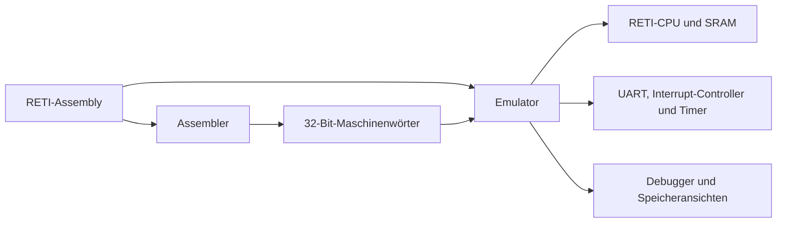
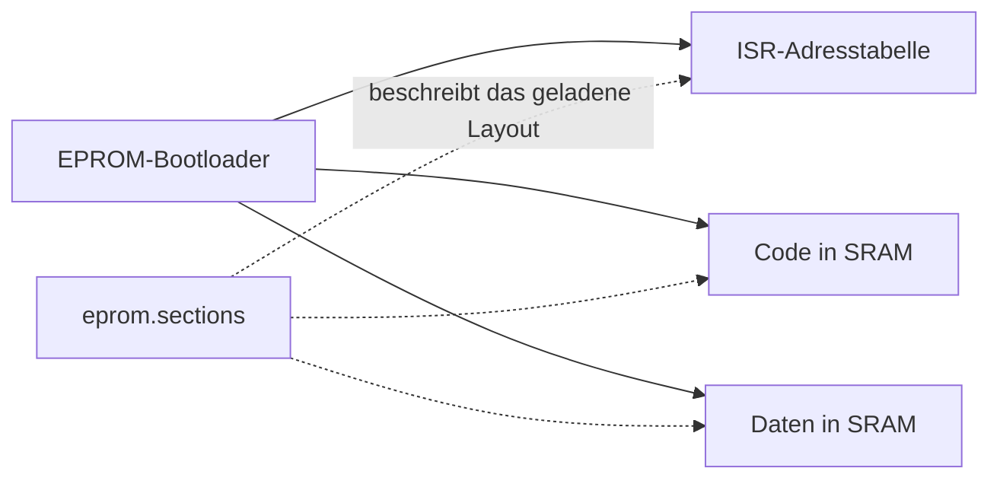
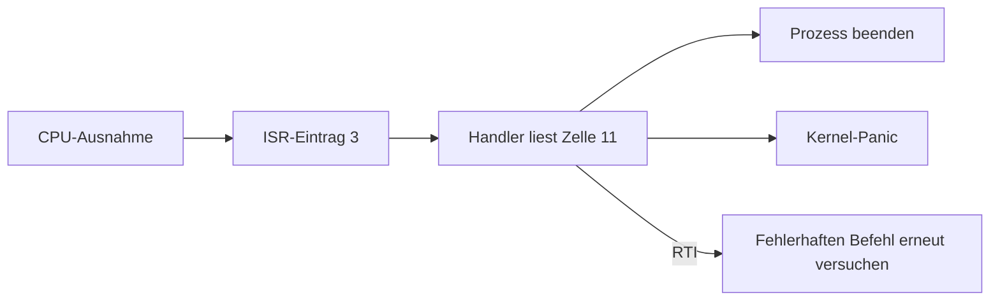
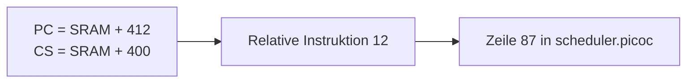
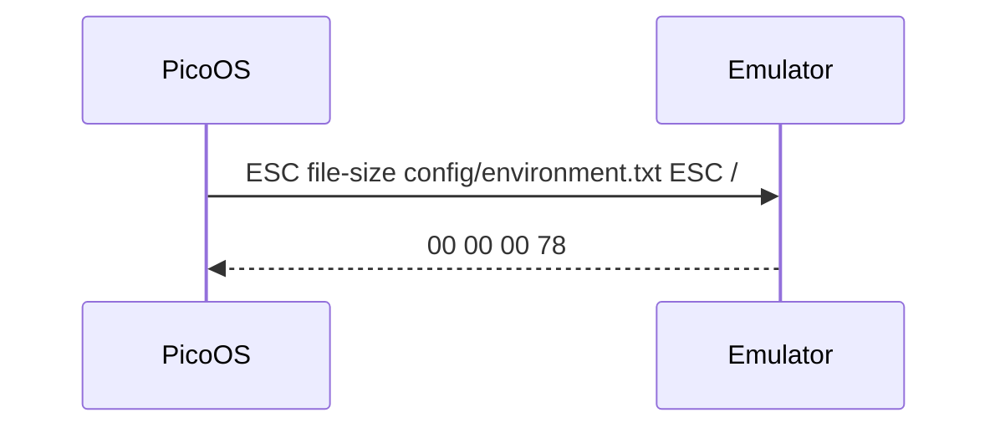
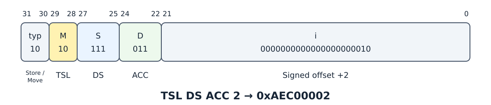

# Was ist der RETI-Emulator?

Eigentlich ist der RETI-Emulator ein **RETI-Emulator**, **RETI-Assembler**,
**RETI-Debugger** und **Visualizer** für die Speicherinhalte der
Peripheriegeräte der RETI während der Ausführung.

- **Interpreter:** Ein Interpreter führt Anweisungen einer Programmiersprache
  direkt aus, ohne sie vorher in Maschinencode zu übersetzen. Die Ausführung
  erfolgt zeilenweise oder schrittweise.
  - *Beispiel:* Python-Interpreter.
- **Assembler:** Ein Assembler übersetzt Code in Assemblersprache in ausführbaren
  Maschinencode, der von einer dafür spezifischen CPU verstanden wird.
  - *Beispiel:* Übersetzung von `MOV AX, BX` in Maschinencode für eine spezifische
    Architektur.
- **Emulator:** Ein Emulator ahmt die Funktionalität eines Systems (z. B. Hardware
  oder Software) nach, sodass Programme für das originale System unverändert
  darauf laufen können.
  - *Beispiele:* QEMU, der die Funktionalität verschiedener CPU-Architekturen
    nachahmt, oder SNES-Emulatoren, welche alte Konsolenspiele auf einem PC
    ausführen.
- **Debugger:** Ein Debugger ist ein Tool, das die Ausführung eines Programms
  erlaubt, mit dem Ziel, Fehler (Bugs) zu finden, zu analysieren und zu beheben.
  Es bietet Funktionen wie Breakpoints, Schritt-für-Schritt-Ausführung und
  Inspektion von Variablen, Registerwerten und Speicherbereichen. Das Programm
  kann in verschiedenen Formen spezifiziert sein, einschließlich Quellcode,
  Bytecode oder ausführbarem Maschinencode.
  - *Beispiel:* GDB (GNU Debugger) für C/C++-Programme.
- **Visualizer:** Ein Visualizer stellt Daten, Abläufe oder Systeme visuell dar,
  um deren Struktur, Verhalten oder Ergebnisse leichter verständlich zu machen.
  - *Beispiel:* Ein Graph-Visualizer, der Knoten und Verbindungen eines Netzwerks
    grafisch darstellt.
- **Simulator:** Ein Simulator modelliert ein System oder dessen Verhalten auf
  höherer Abstraktionsebene, um Analysen, Tests oder Training durchzuführen,
  ohne jede Funktionalität notwendigerweise exakt nachzubilden.
  - *Beispiel:* Flugsimulator für Pilotentraining.

Der RETI-Emulator hat zum einen das Ziel, dass darauf das minimale, in PicoC
geschriebene Betriebssystem [`PicoOS`](../Pico-OS/README.md) läuft. Ein
weiteres Ziel des RETI-Emulators ist es, im Übungsbetrieb die Studenten beim
Schreiben von RETI-Programmen zu unterstützen. Daher zeigt der RETI-Emulator
auch Fehlermeldungen an und hat einen stärkeren Fokus auf Bugtesting und
Features, welche die Verwendung für Studenten angenehmer gestalten.

Die Aufzeichnung zeigt die Debug-TUI während der Ausführung eines RETI-Programms:

[](https://asciinema.org/a/693086)

Das Diagramm zeigt, wie Assembly und Maschinenwörter in die Ausführung gelangen
und welche Teile der Emulator dabei nachbildet:


```mermaid
flowchart LR
    source[RETI-Assembly] --> assembler[Assembler]
    assembler --> machine[32-Bit-Maschinenwörter]
    source --> emulator[Emulator]
    machine --> emulator
    emulator --> cpu[RETI-CPU und SRAM]
    emulator --> periphery[UART, Interrupt-Controller und Timer]
    emulator --> debugger[Debugger und Speicheransichten]
```

# Übersicht

Die Kommandozeilenoptionen legen fest, was geladen und angezeigt wird.
Während der Ausführung wird der Debugger über die TUI bedient.
Die Tests liegen in [`unit_test`](unit_test) mit **19 C-Testdateien** und
[`system_test`](system_test) mit **32 RETI-Testprogrammen**.

## Kommandozeilenoptionen

Die Optionen werden vor dem Programmpfad angegeben. Ihre Verarbeitung steht in
[`parse_args()`](source/parse/parse_args.c#L62).

- `-r ram_size`: Anzahl adressierbarer 32-Bit-Wörter im SRAM, standardmäßig `65536`
- `-d`: Öffnet die Ncurses-Debug-TUI
- `-K`: Hält die Debug-TUI nach dem abschließenden `JUMP 0` geöffnet, bis sie mit `q` beendet wird
- `-f file_dir`: Erstellt das Arbeitsverzeichnis `.reti_emulaor` unter diesem Pfad
- `-e eprom_prgrm_path`: Lädt ein eigenes EPROM-Startprogramm
- `-i isrs_prgrm_path`: Lädt Interrupt-Service-Routinen aus einer eigenen Datei
- `-C interrupt_controller_config_path`: Lädt die Zuordnung und Prioritäten der Hardware-Interrupts
- `-n isr_count`, `--isr-count isr_count`: Setzt die Anzahl der ISR-Tabelleneinträge auf `0` bis `255`
- `-S sections_path`: Verwendet diese `.sections`-Datei statt `<program>.sections`
- `-D debuginfo_path`: Verwendet diese `.debuginfo`-Datei statt `<program>.debuginfo`
- `-w max_waiting_instrs`: Maximale UART-Wartezeit in ausgeführten Befehlen, standardmäßig `10`
- `-t`: Schreibt Systemtest-Ausgaben nach `<program>.output` und Fehler nach `<program>.error`
- `-m`: Liest UART-Eingaben aus dem Kommentar `# input: ...`
- `-c`: Zeigt Quellkommentare im Debugger an
- `-v`: Gibt die eingestellten Optionen aus
- `-b`: Zeigt Zahlen binär an
- `-E`: Aktiviert zusätzliche Hilfslinien im Debugger
- `-a`, `--assemble`: Schreibt `<program>.bin` mit Loader-Header und Maschinenwörtern. Das Format steht in [`Abschnittsdateien für Compiler-Ausgaben`](#abschnittsdateien-für-compiler-ausgaben)
- `-u`: Zeigt Werte im Datensegment als vorzeichenlose Zahlen an
- `-I timer_interrupt_interval`: Timer-Intervall in ausgeführten Befehlen, standardmäßig `0` für einen deaktivierten Timer
- `-O`: Ermöglicht den Start des ersten Prozesses per `RTI`
- `-M`, `--dma`: Aktiviert den DMA-Controller beim Start
- `-h`: Zeigt die Verwendungshinweise
- `-V`, `--version`: Gibt die Version aus

## TUI-Aktionen

Die Textoberfläche (TUI) zeigt die verfügbaren Tasten in einer Infobox.
Mit `o` wird zwischen deren drei Hilfeseiten gewechselt:


```mermaid
flowchart LR
    execution[Ausführung] -->|o| windows[Fenster und Interrupts]
    windows -->|o| tools[Snapshots, Quellcode und UART]
    tools -->|o| execution
```

Die wichtigsten Aktionen sind in der folgenden Tabelle zusammengefasst.
Groß- und Kleinschreibung unterscheiden sich.

| Taste | Aktion |
| --- | --- |
| `n` | Nächsten Befehl ausführen |
| `c` | Bis zum nächsten Breakpoint `INT 3` weiterlaufen |
| `E` | Kontinuierliche Ausführung unterbrechen und zum schrittweisen Debuggen zurückkehren |
| `r` | Programm mit denselben Argumenten neu starten |
| `s` / `f` | ISR betreten / abschließen |
| `Tab` / `Shift-Tab` | Nächstes / vorheriges TUI-Fenster auswählen |
| `j` / `k` | Im ausgewählten Adressfenster scrollen |
| `J` / `K` | Beobachtete Adresse oder beobachteten Registerwert erhöhen / verringern |
| `C` | Ansicht wieder auf das Watchobject zentrieren |
| `a` | Watchobject einem Register oder einer Adresse zuweisen |
| `A` | Wert im ausgewählten Fenster ändern, siehe [`Fenster, Watchobjects und Live-Bearbeitung`](#fenster-watchobjects-und-live-bearbeitung) |
| `T` / `e` | Ausgewählte ISR auslösen / nächste manuell auslösbare ISR auswählen |
| `S` / `R` | Snapshot speichern / wiederherstellen |
| `d` | PicoC-Quellcodeansicht öffnen |
| `O` | PicoOS-Übersicht für Prozesse, Speicher und Kernelaktivität öffnen |
| `t` | SRAM-Anzeige zwischen Zahlen, ASCII und RETI-Instruktionen wechseln, siehe [`Debugging`](#debugging) |
| `v` | UART-Terminalansicht öffnen, Rückkehr mit `Escape` |
| `V` | Rohe UART-Terminalansicht öffnen, Rückkehr mit `Ctrl+]` |
| `q` | Menü oder Emulator verlassen |

# Installation und Updates

Unter Linux gibt es zwei Installationsarten: eine fertige Binary für den
eigenen Benutzer oder einen selbst kompilierten Emulator für alle Benutzer.
Die folgenden Befehle verwenden den [`Makefile`](Makefile) des Repositorys.

## Lokale Installation unter Linux

Die lokale Installation lädt eine fertige statische Binary nach `~/.local/bin`.
Dafür werden Git, Make und Wget benötigt, aber kein C-Compiler:

```bash
$ git clone -b main https://github.com/matthejue/RETI-Emulator.git ~/RETI-Emulator --depth 1
$ cd ~/RETI-Emulator
$ make install-linux-local
```

## Globale Installation unter Linux

Die globale Installation kompiliert den Emulator und verlinkt ihn unter
`/usr/local/bin`. Dafür werden ein C-Compiler, die Ncurses-Entwicklungsdateien
und für die Installation `sudo` benötigt:

```bash
$ git clone -b main https://github.com/matthejue/RETI-Emulator.git ~/RETI-Emulator --depth 1
$ cd ~/RETI-Emulator
$ make install-linux-global
```

## Lokale Installation entfernen

Zum Entfernen der lokalen Binary wird im geklonten Repository ausgeführt:

```bash
$ cd ~/RETI-Emulator
$ make uninstall-linux-local
```

## Globale Installation entfernen

Der folgende Befehl entfernt den globalen Link aus `/usr/local/bin`:

```bash
$ cd ~/RETI-Emulator
$ make uninstall-linux-global
```

## Lokale Installation aktualisieren

Das Update aktualisiert das Repository und lädt die aktuelle Release-Binary:

```bash
$ cd ~/RETI-Emulator
$ make update-linux-local
```

## Globale Installation aktualisieren

Das globale Update aktualisiert das Repository und kompiliert den Emulator neu:

```bash
$ cd ~/RETI-Emulator
$ make update-linux-global
```

> Beim Wechsel der Installationsart zuerst die bisherige Installation entfernen,
> damit nicht zwei verschiedene Versionen über den Suchpfad erreichbar sind.


# Verwendung

Der Emulator assembliert eine `.reti`-Datei und lädt ihre Maschinenwörter in den
simulierten SRAM. Ein automatisch erzeugtes EPROM-Startprogramm setzt die
Startregister und springt zum Programm. Eine eigene Datei `prgrm.reti` wird so
gestartet:

```bash
$ reti_emulator ./prgrm.reti
```

Ohne `-d` erscheinen abgeschlossene UART-Sendungen als rohe Bytes auf `stdout` und können wie gewohnt umgeleitet werden:

```bash
$ reti_emulator ./prgrm.reti > ausgabe.txt
```

Dieses Beispiel multipliziert `3` mit `7`. Mit `-d` hält der Debugger bei
`INT 3`, sodass sich das Ergebnis `21` in [`ACC`](include/assemble.h#L22) ansehen lässt:

```reti
INT 3 # just a breakpoint, use c in debug mode -d to directly jump here
LOADI ACC 3
MOVE ACC IN1
LOADI ACC 7
MULT ACC IN1
INT 3
JUMP 0
```

> `JUMP 0` beendet die Ausführung. Ohne diesen Abschluss führt der Emulator
> auch die nachfolgenden SRAM-Wörter als Befehle aus.

Der SRAM liegt in `.reti_emulaor/sram.bin`, mit vier Bytes pro Speicherwort.
Die Datei wächst bei Schreibzugriffen und kann als Sparse File unbeschriebene
Bereiche platzsparend abbilden. `ls -lh` zeigt ihre logische Größe, `du -h` den
tatsächlich belegten Speicherplatz. `-r 65536` begrenzt den adressierbaren SRAM
auf 256 KiB, reserviert aber nicht sofort eine Datei dieser Größe.

> Mit `-f /tmp` entstehen die Arbeitsdateien unter `/tmp` statt im aktuellen
> Verzeichnis. Liegt `/tmp` auf einem tmpfs, werden sie im Arbeitsspeicher gehalten.

## Direkte Speicherwerte in `.reti`-Dateien

Eine `.reti`-Datei kann neben Instruktionen auch Daten enthalten. Zahlen und
einzelne ASCII-Zeichen in einfachen Anführungszeichen werden direkt als
32-Bit-Wörter gespeichert.

Im Beispiel überspringt `JUMP 5` die vier Datenwörter, damit sie nicht als
Befehle ausgeführt werden:

```reti
LOADI ACC 1
JUMP 5
42
-1
'e'
'!'
JUMP 0
```

Die Datenwörter enthalten `42`, `-1` sowie die ASCII-Werte `101` und `33`.
So lassen sich etwa Strings und Compiler-Daten im SRAM ablegen.

## Abschnittsdateien für Compiler-Ausgaben

Eine `.sections`-Datei beschreibt die Aufteilung einer Compiler-Ausgabe in
Interrupt-Service-Routinen, Code und Daten. Zu `program.reti` wird automatisch
`program.sections` gesucht. Mit `-S sections_path` lässt sich ein anderer Pfad
angeben. Intern speichert [`Program_Sections`](include/parse/parse_sections.h#L22)
die Grenzen.

Das folgende Beispiel legt den Programmcode ab Wort `40` und die Daten ab
Wort `180` ab:

```json
{
  "interrupt_service_routines_start": 4,
  "codesegment_start": 40,
  "datasegment_start": 180,
  "heap_start": 400,
  "heap_size": -1,
  "stack_start": 8000
}
```

Die Adressen zählen geparste 32-Bit-Wörter ab `0`, keine Textzeilen. Daraus
ergibt sich für dieses Beispiel die folgende Aufteilung:

| SRAM-relativer Bereich | Inhalt |
| --- | --- |
| `0..3` | Startadressen der Interrupt-Service-Routinen |
| `4..39` | Interrupt-Service-Routinen |
| `40..179` | Codesegment |
| `180..end` | Rohe Wörter des Datensegments |

Der Debugger zeigt Code als Instruktionen und Daten zunächst als Zahlen an.
[`interrupt_service_routines_start`](include/parse/parse_sections.h#L16) trennt die Adresstabelle vom ISR-Code.
Zur Laufzeit bestimmen [`CS`](include/assemble.h#L25) und [`DS`](include/assemble.h#L26) die angezeigten Code- und Datenbereiche,
auch nach einem Prozesswechsel. Ungültige Maschinenwörter bleiben in der
Anzeige als Zahlen sichtbar.

Für `--assemble` sind zusätzlich [`heap_start`](include/parse/parse_sections.h#L14), [`heap_size`](include/parse/parse_sections.h#L15) und [`stack_start`](include/parse/parse_sections.h#L17)
erforderlich. `heap_size: -1` lässt das ladende System die Heapgröße bestimmen.
Andere Werte geben die Größe in SRAM-Wörtern an. Die Binärdatei wird so erzeugt:

```bash
$ reti_emulator --assemble program.reti
```

Der Befehl schreibt `program.bin` und beendet den Emulator. Vor den
Maschinenwörtern steht der Loader-Header mit diesen fünf Werten:

| 32-Bit-Wort | Inhalt |
| ---: | --- |
| `0` | [`codesegment_start`](include/parse/parse_sections.h#L12) |
| `1` | [`datasegment_start`](include/parse/parse_sections.h#L13) |
| `2` | [`heap_start`](include/parse/parse_sections.h#L14) |
| `3` | [`heap_size`](include/parse/parse_sections.h#L15) |
| `4` | [`stack_start`](include/parse/parse_sections.h#L17) |
| `5` und folgende | Assemblierte SRAM-Wörter |

Beim normalen Start setzt das automatisch erzeugte EPROM-Programm [`SP`](include/assemble.h#L23) auf
[`stack_start`](include/parse/parse_sections.h#L17) mit der SRAM-Adresskonstante. Der Wert `-1` setzt [`SP`](include/assemble.h#L23) stattdessen
auf die letzte adressierbare SRAM-Zelle.

Ein eigenes EPROM-Startprogramm kann den SRAM auch selbst laden, wie beim
Bootloader von PicoOS. Dafür genügt der EPROM-Pfad:

```bash
$ reti_emulator -e eprom.reti
```

Optional beschreibt `eprom.sections` das später geladene SRAM-Layout für den
Debugger. Ohne Abschnittsdatei beginnt die SRAM-Anzeige mit Zahlen.
Das Diagramm zeigt die Rolle dieser Datei beim Booten:


```mermaid
flowchart LR
    eprom[EPROM-Bootloader] --> vectors[ISR-Adresstabelle]
    eprom --> code[Code in SRAM]
    eprom --> data[Daten in SRAM]
    sections[eprom.sections] -. beschreibt das geladene Layout .-> vectors
    sections -.-> code
    sections -.-> data
```

Mit `-S` und `-D` können Layout und Debuginformationen auch in anderen
Build-Verzeichnissen liegen:

```bash
$ reti_emulator -S build/layout/kernel.sections \
                -D build/debug/kernel.debuginfo \
                build/asm/pico_os.reti
```

### Interrupt-Service-Routinen laden und zuordnen

Mit `-i isrs.reti` werden Interrupt-Service-Routinen (ISRs) vor dem Programm
in den SRAM geladen. `INT i` ruft die zugehörige Routine auf, `RTI` kehrt zum
folgenden Befehl zurück. `INT 3` ist als Debugger-Breakpoint reserviert.

Bei Compiler-Ausgaben mit `.sections` gibt es zwei Möglichkeiten:

- Mit `-i` ersetzt die eigene ISR-Datei den Abschnitt vor [`codesegment_start`](include/parse/parse_sections.h#L12).
- Ohne `-i` werden die Adresstabelle und ISRs aus diesem Abschnitt geladen.

Die ISR-Adresstabelle steht am Anfang des SRAM. Ein Eintrag enthält die
Startadresse seiner Routine. Beim Aufruf ergänzt der Emulator die
SRAM-Adressbits, sofern sie nicht schon enthalten sind. `INT 0` verwendet den
ersten Eintrag, `INT 1` den zweiten. ISR-Nummern reichen von `0` bis `254`,
`255` bedeutet intern „keine ISR zugeordnet“.

Der Parser zählt die Tabelleneinträge beim Laden. Lädt erst der Bootloader die
Tabelle, muss die Anzahl mit `-n` angegeben werden. Diese Option überschreibt
den ermittelten Wert. Für vier Einträge lautet der Aufruf:

```bash
$ reti_emulator -n 4 -e startprogram.reti
```

Synchrone CPU-Ausnahmen verwenden ISR-Eintrag `3` und benötigen daher mindestens
vier Einträge. Andernfalls beendet eine Ausnahme die Ausführung mit einer
Fehlermeldung. Mehr dazu steht in [`Synchrone CPU-Ausnahmen`](#synchrone-cpu-ausnahmen).

### Speicherabgebildete Peripherie

UART, Interrupt-Controller, Timer, CPU-Ausnahmen und DMA sind über Speicherzugriffe
erreichbar. Die Zellennummern in der Tabelle sind Offsets zur Peripherieadresse
`2^30`. Die Zuordnung steht in [`interrupt_controller.h`](include/interrupt_controller.h)
und [`dma.h`](include/dma.h):

| Zelle | Bedeutung |
| ---: | --- |
| `0` | UART-Senderegister R0 |
| `1` | UART-Empfangsregister R1 |
| `2` | UART-Statusregister R2 mit `b0` sendebereit und `b1` empfangsbereit |
| `3` | Signalleitung `INTTIMER` → ISR-Nummer |
| `4` | Signalleitung `CUSTOM` → ISR-Nummer |
| `5` | Signalleitung `UART` → ISR-Nummer |
| `6` | Priorität von `INTTIMER` |
| `7` | Priorität von `CUSTOM` |
| `8` | Priorität von `UART` |
| `9` | Timer-Interrupt-Intervall |
| `10` | Inklusive Stack/Heap-Grenze des aktuellen Kontexts |
| `11` | Ursache der letzten synchronen CPU-Ausnahme |
| `12` | DMA aktiv (`0` deaktiviert, `1` aktiviert) |
| `13` | DMA-Quelladresse |
| `14` | DMA-Zieladresse |
| `15` | Anzahl zu übertragender 32-Bit-Wörter |
| `16` | DMA-Status/Steuerung (`0` bereit, `1` starten/beschäftigt, `2` fertig, `3` Fehler) |

In den ISR-Zellen bedeutet `255` „keine Zuordnung“. Prioritäten reichen von
`0` bis `255`. Größere Werte
erlauben einem Hardware-Interrupt, eine Routine mit niedrigerer Priorität zu
unterbrechen. Intern halten [`device_to_isr`](source/periphery/interrupt_controller.c#L10)
und [`device_to_prio`](source/periphery/interrupt_controller.c#L11) diese Zuordnung.

Von den DMA-Zellen ist ohne `-M` zunächst nur Zelle `12` erreichbar. Eine `1`
aktiviert DMA und macht die Zellen `13..16` verfügbar. Die Quelle muss das
UART-Empfangsregister (`2^30 + 1`) sein, das Ziel eine SRAM-Adresse. Nach dem
Start über Zelle `16` kopiert DMA pro Emulatorzyklus ein 32-Bit-Wort.
Abschluss und Fehler lösen die Signalleitung `CUSTOM` aus.

Der Timer wird mit `-I` oder durch Schreiben in Zelle `9` eingestellt.
`0` deaktiviert ihn, ein positiver Wert legt das Intervall in ausgeführten
Befehlen fest. Der Debugger zeigt auch den laufenden Timerzähler an.

Eine eigene Datei `interrupts.conf` kann mit `-C` die Zuordnung beim Start
festlegen. Jede Zeile gehört zu einem ISR-Index und enthält `<priority> <device>`.
Dieses Beispiel lässt ISR `0` unzugeordnet und weist Timer und UART den
ISRs `1` und `2` mit den Prioritäten `1` und `3` zu:

```conf
-
1 INTTIMER
3 UART
```

Die Konfiguration wird zusammen mit dem Programm geladen:

```bash
$ reti_emulator -C interrupts.conf program.reti
```

### Synchrone CPU-Ausnahmen

Bei einer CPU-Ausnahme hinterlässt der fehlerhafte Befehl keine teilweise
geschriebenen Ergebnisse. Die Ausnahmebehandlung ruft unabhängig von
Hardware-Prioritäten ISR `3` auf. Ihre Ursache steht in Zelle `11`:

| Wert in Zelle `11` | Ursache |
| ---: | --- |
| `1` | Division oder Modulo durch null |
| `2` | Stacküberlauf |
| `3` | Ungültige Instruktion |

Zelle `10` enthält die unterste erlaubte Stackadresse. Bei einer Grenze von
`5000` darf [`SP`](include/assemble.h#L23) von `5001` auf `5000` sinken, aber nicht auf `4999`.
`0` deaktiviert diesen Schutz. PicoOS aktualisiert die Grenze beim Wechsel
zwischen Kernel und Prozess mit [`activate_kernel_stack_boundary()`](../Pico-OS/kernel/exception.picoc#L11)
und [`activate_current_process_stack_boundary()`](../Pico-OS/kernel/exception.picoc#L22).

Die ISR entscheidet, wie es weitergeht. PicoOS beendet den betroffenen Prozess
oder hält bei einer Kernel-Panic an. Eine eigene ISR kann mit `RTI` den
fehlerhaften Befehl erneut versuchen, wie im Diagramm dargestellt:


```mermaid
flowchart LR
    fault[CPU-Ausnahme] --> vector[ISR-Eintrag 3]
    vector --> handler[Handler liest Zelle 11]
    handler --> terminate[Prozess beenden]
    handler --> panic[Kernel-Panic]
    handler -->|RTI| retry[Fehlerhaften Befehl erneut versuchen]
```

### Ersten Prozess per `RTI` starten

PicoOS startet Prozesse über denselben Rückkehrweg wie nach einem Interrupt.
`-O` erzeugt deshalb beim Emulatorstart einen synthetischen ISR-Kontext, damit
schon das erste `RTI` den vorbereiteten Prozess-Stack verwenden kann:

```bash
$ reti_emulator -O pico_os.reti
```

Der Kernel bereitet den Stack vor und startet damit den ersten Prozess:


```mermaid
flowchart LR
    kernel[Kernel startet im synthetischen ISR-Kontext] --> stack[Kernel bereitet den Prozess-Stack vor]
    stack -->|RTI| process[Erster Prozess läuft]
```

Die folgende Skizze zeigt den Aufbau einer eigenen `isrs.reti`: zuerst die
Startadressen, danach die Routinen. `...` steht für ausgelassenen ISR-Code,
die Adressen müssen zu den tatsächlichen Wortpositionen passen. Die Skizze
ist daher keine direkt ausführbare Datei:

```reti
# Startadressen der Interrupt-Service-Routinen
5
19
33
47
51

# == INT 0 ==
# Interrupt Service Routine für Software-Interrupt 0
...
RTI

# == INT 1 ==
# Interrupt Service Routine für Software-Interrupt 1
...
RTI

# == INT 2 ==
# Interrupt Service Routine für Software-Interrupt 2
...
RTI

# == CUSTOM ==
# Interrupt Service Routine für den durch 'T' im TUI ausgelösten Interrupt
...
RTI

# == INTTIMER ==
# Interrupt Service Routine für den automatischen Timer-Interrupt
...
RTI
```

Jede Routine kehrt üblicherweise mit `RTI` zurück.

## Debugging

Mit `-d` zeigt der Debugger Register und Speicher nach jedem Befehl.
`n` führt den nächsten Befehl aus, `c` läuft bis zum nächsten Breakpoint
`INT 3`. Währenddessen hält `E` die Ausführung an der aktuellen Adresse an,
`q` beendet den Emulator. Die verfügbaren Tasten stehen in der Infobox.

Mit `-K` bleibt die TUI auch nach `JUMP 0` geöffnet, um den Endzustand zu
untersuchen. Der folgende Aufruf kombiniert beide Optionen:

```bash
$ reti_emulator -d -K pico_os.reti
```

`r` startet das Programm mit denselben Argumenten neu. Die Hilfeseiten und
weiteren Tasten sind unter [`TUI-Aktionen`](#tui-aktionen) zusammengefasst.
`T` löst die dort angezeigte ISR aus. Mit `e` wird zwischen den vorhandenen
ISRs gewechselt, unabhängig davon, ob sie aus `-i` oder einer Compiler-Ausgabe
stammen.

`t` wechselt die SRAM-Anzeige von der normalen Zahlendarstellung zu
vorzeichenlosen Zahlen, ASCII und RETI-Instruktionen. Vorzeichenlose Zahlen
sind etwa für Adressen nützlich. ASCII erscheint für Werte von `0` bis `127`,
Instruktionen für gültige Maschinenwörter. Sonst bleibt die Zahlendarstellung
erhalten. Erkannter Code wird weiterhin als Instruktion angezeigt.
`-u` wählt vorzeichenlose Zahlen als normale Darstellung im Datensegment.

`v` und `V` öffnen das [`UART-Terminal im Debugger`](#uart-terminal-im-debugger).
Mit `-c` erscheinen zusätzlich die Kommentare der `.reti`-Datei neben den
zugehörigen Instruktionen.

> Mit `-b` lässt sich etwa beim Shiften die Änderung einzelner Bits verfolgen.
> Ein `INT 3` am Programmanfang hält nach `c` direkt hinter dem EPROM-Startprogramm.

### PicoC-Quellcode und Symbolinformationen

Mit `d` zeigt der Debugger die PicoC-Zeile zur aktuellen RETI-Programmadresse.
Dafür benötigt er `<program>.debuginfo` oder die mit `-D` angegebene Datei.
Wenn vorhanden, wird die zugehörige `.pre`-Datei mit vorverarbeitetem Code
angezeigt, sonst die Quelldatei. Die Ansicht verwendet Python 3 mit Tkinter.
Das Beispiel zeigt die Zuordnung über die relative Adresse `PC - CS`:


```mermaid
flowchart LR
    registers["PC = SRAM + 412<br/>CS = SRAM + 400"] --> relative[Relative Instruktion 12]
    relative --> source[Zeile 87 in scheduler.picoc]
```

Dieselben Metadaten beschriften SRAM-Zeilen anhand des aktiven Stackframes.
Die Tabelle zeigt beispielhafte Beschriftungen für globale und lokale
Variablen, eine Rücksprungadresse und ein Argument:

| SRAM-Adresse | Wert | Symbolische Beschriftung |
| ---: | ---: | --- |
| `8012` | `3` | `global current_pid@12` |
| `8179` | `42` | `var timeslice@0` |
| `8182` | `9001` | `return addr.` |
| `8183` | `7` | `arg next_pid@0` |

Auch gespeicherte Framepointer werden so direkt am Speicherwert erkennbar.

Mit `O` öffnet sich zusätzlich die [`PicoOS-Übersicht`](source/debug/picoos_overview.py).
Sie zeigt Prozesse, Speicherbereiche, Interrupts und Kernelaktivität anhand
der `.overview`-Metadaten neben der Debuginfo-Datei. Bei angehaltener Ausführung
öffnet ein Doppelklick auf einen Speichereintrag dessen Adresse im zuvor
ausgewählten SRAM-Fenster. Auch diese Ansicht benötigt Python 3 mit Tkinter.

### Fenster, Watchobjects und Live-Bearbeitung

Ein **Watchobject** legt fest, welche Adresse ein Speicherfenster beobachtet.
Sie stammt aus einem Register oder wird direkt angegeben. In
[`WatchBox`](include/core_debug.h#L34) stehen [`box`](include/core_debug.h#L30)
für das Fenster, [`watchobject`](include/core_debug.h#L31) für das Register,
[`watchobject_addr`](include/core_debug.h#L32) für eine feste Adresse und
[`scroll_offset`](include/core_debug.h#L33) für den Scrollversatz.
Die beobachtete Zelle wird über die gesamte Fensterbreite hervorgehoben.

`Tab` und `Shift-Tab` wählen das Fenster aus. `j` und `k` scrollen,
`C` zentriert wieder auf die beobachtete Adresse. `a` weist ein anderes Register
oder eine feste Adresse zu. `J` und `K` ändern diese Adresse beziehungsweise
den Wert des zugewiesenen Registers.

Mit `A` wird ein Wert im ausgewählten Fenster geändert:

- Im Registerfenster wird ein Register mit `↑` / `↓` oder `j` / `k` ausgewählt. `Enter` bestätigt erst die Auswahl und dann den neuen Wert.
- Im Peripheriefenster wird zuerst der Registerindex und dann der Wert eingegeben. Die Indizes stehen unter [`Speicherabgebildete Peripherie`](#speicherabgebildete-peripherie). Zelle `11` ist schreibgeschützt, die DMA-Zellen `13..16` benötigen eine aktive Zelle `12`.
- In einem Adressfenster wird der Wert der beobachteten Speicherzelle geändert.

`q` oder `Esc` brechen das Menü ab. Als Werte sind `-2147483648` bis `4294967295`
und einzelne Zeichen erlaubt. Anführungszeichen unterscheiden Zeichen von
Zahlen, wie diese Beispiele zeigen:

| Eingabe | Geschriebener Wert |
| --- | ---: |
| `1` | `1` |
| `'1'` | `49` |
| `'\n'` | `10` |
| `'\t'` | `9` |
| `'\\'` | `92` |

Druckbare Zeichen ohne Ziffern können auch ohne Anführungszeichen eingegeben
werden. Für `q` ist wegen der Abbruchtaste `'q'` nötig. EPROM und SRAM lassen
sich nur innerhalb der geladenen Bereiche bearbeiten.

### Wiederverwendbare Snapshots

`S` speichert Register, SRAM und den internen Ausführungszustand.
`R` stellt diesen Snapshot beliebig oft wieder her. Damit lassen sich etwa
zwei Schedulerentscheidungen aus demselben Ausgangszustand vergleichen:


```mermaid
flowchart LR
    before[Vor der Schedulerentscheidung] -->|S| snapshot[(Snapshot)]
    snapshot --> processA[Prozess A ausführen]
    snapshot --> processB[Prozess B ausführen]
    processA -->|R| snapshot
    processB -->|R| snapshot
```

## UART

Die UART verbindet das RETI-Programm mit Terminal und Host-Diensten.
Sie überträgt 8-Bit-Bytes über drei Register. Zahlen und Strings bestehen dabei
aus mehreren Bytes, nicht aus einem eigenen UART-Datentyp:

| Zelle | Register | Wichtiger Zustand |
| ---: | --- | --- |
| `0` | R0, Sendebyte | `b0` in R2 löschen, um das Senden zu starten |
| `1` | R1, Empfangsbyte | Lesen, nachdem `b1` in R2 gesetzt wurde |
| `2` | R2, Status | `b0` = sendebereit, `b1` = empfangsbereit |

Für die Übertragung verwendet das Programm die Statusbits als Handshake:

- **Senden:** Ein Byte nach R0 schreiben und `b0` in R2 löschen. Nach der UART-Wartezeit wurde das Byte übertragen und `b0` wird wieder gesetzt.
- **Empfangen:** `b1` in R2 löschen, um ein Byte anzufordern. Sobald der Emulator R1 gefüllt und `b1` gesetzt hat, kann das Programm R1 lesen.

Ohne `-d` ist das aufrufende Terminal direkt mit der UART verbunden.
Ausgaben erscheinen auf `stdout`, Tastendrücke lösen UART-Hardwareinterrupts
aus. Im Debugger übernehmen `v` und `V` diese Verbindung, wie unter
[`UART-Terminal im Debugger`](#uart-terminal-im-debugger) beschrieben.

Für Polling-Eingaben außerhalb einer Terminalansicht fragt der Emulator nach
neuem Text, sobald der Eingabepuffer leer ist. Eine leere Eingabe liefert `\n`,
Escape-Sequenzen wie `\n` und `\t` werden ausgewertet.
Mit `-m` stammt der Puffer stattdessen aus `# input: ...` am Dateianfang.
Der gesamte Text nach `input:` bleibt erhalten, einschließlich des ersten
Leerzeichens. Escape-Sequenzen werden ausgewertet und ein Zeilenumbruch
angehängt. Das übernimmt [`extract_input_from_comment()`](source/special_opts.c#L22).

Bei Terminaleingaben wartet das nächste gepufferte Byte, bis der vorherige
UART-Interrupt abgeschlossen ist. Das Diagramm zeigt diesen Weg:


```mermaid
flowchart LR
    key[Tastendruck] --> queue[UART-Eingabepuffer]
    queue --> register[Empfangsbyte nach R1]
    register --> status[b1 in R2 setzen]
    status --> interrupt[UART-Interrupt auslösen]
```

### Host-Dienste über UART

PicoOS kann über die UART Dateien auf dem Host lesen und schreiben.
Dazu wird ein Befehl mit dem Escape-Byte `27` eingerahmt:
`<esc>Aktion<esc>/`. Der Emulator verarbeitet den Rahmen, statt ihn anzuzeigen.
Ohne diesen Rahmen bleibt etwa `load <path>` normale Textausgabe.
Das Beispiel fragt die Größe von [`config/environment.txt`](../Pico-OS/config/environment.txt) ab:


```mermaid
sequenceDiagram
    participant PicoOS
    participant Emulator
    PicoOS->>Emulator: ESC file-size config/environment.txt ESC /
    Emulator-->>PicoOS: 00 00 00 78
```

Bei einer beispielhaften Dateigröße von `120` lautet die Antwort
`00 00 00 78`, also Big Endian. Alle 32-Bit-Antwortwerte verwenden diese
Byte-Reihenfolge.

Das Startverzeichnis des Emulators wird zur Gastwurzel `/`. Bei PicoOS ist das
das Laufzeitverzeichnis mit `kernel`, `boot`, `system`, `user`, `config` und
`device`. Gastpfade werden von dieser Wurzel aus aufgelöst. `..` führt nicht
darüber hinaus. Ein Gastpfad `/tmp` ist ein Unterverzeichnis dieser Wurzel,
keine Verbindung zum `/tmp` des Hosts.

[`guest_filesystem.c`](source/guest_filesystem.c) begrenzt die Dateizugriffe auf
diesen Baum. Symbolische Links, Windows-Junctions, mehrfach hart verlinkte und
spezielle Dateien werden nicht geöffnet. Die Gastwurzel selbst lässt sich
nicht entfernen oder umbenennen. Unter Linux verhindert `openat2` auch das
Durchqueren weiterer Mounts. Ältere Kernel und andere POSIX-Systeme verwenden
verzeichnisrelative `openat`-Aufrufe mit `O_NOFOLLOW`.

Unter Windows übernimmt [`guest_filesystem_windows.inc`](source/guest_filesystem_windows.inc)
die Zugriffe über relative Verzeichnishandles und `NtCreateFile` mit
`OBJ_DONT_REPARSE`. Auch Listen, Zeitstempel, Umbenennen und Entfernen arbeiten
mit Handles und benötigen keine `dirent`-Kompatibilität.

Diese Grenze gilt für UART-Anfragen des RETI-Programms. Kommandozeilenargumente
für Programme und Metadaten bleiben Hostpfade. Der Emulator führt nur die
folgenden **14 Host-Befehle** aus, keine allgemeinen Shellbefehle:

| Aktion | Antwort oder Wirkung |
| --- | --- |
| `load <path>` | 32-Bit-Wortanzahl, danach Inhalt eines assemblierten Binärprogramms |
| `read-range <offset> <count> <path>` | Tatsächliche 32-Bit-Byteanzahl, danach höchstens `count` Bytes ab `offset` |
| `file-size <path>` | 32-Bit-Dateigröße, verwendet von [`file_exists()`](../Pico-OS/kernel/filesystem/filesystem.picoc#L18) und bei [`SEEK_END`](../Pico-OS/common/file.header#L19) |
| `pwd` | Liefert die Byteanzahl `1` und `/` |
| `is-directory <path>` | Prüft innerhalb der Gastwurzel, ob der Pfad ein Verzeichnis bezeichnet, und liefert `0` oder `UINT32_MAX` |
| `mkdir <path>` | Erstellt ein Verzeichnis innerhalb der Gastwurzel und liefert `0` oder `UINT32_MAX` |
| `ls` / `ls <path>` | Textliste mit 32-Bit-Byteanzahl. Jede Zeile enthält `d ` oder `- ` und den Namen, auch für versteckte Einträge |
| `unlink <path>` | Entfernt einen Dateieintrag innerhalb der Gastwurzel und liefert `0` oder `UINT32_MAX` |
| `rmdir <path>` | Entfernt ein leeres Verzeichnis innerhalb der Gastwurzel und liefert `0` oder `UINT32_MAX` |
| `move <old path>\n<new path>` | Verschiebt oder benennt eine Datei oder ein Verzeichnis um und liefert `0` oder `UINT32_MAX` |
| `touch <path>` | Erstellt eine Datei oder aktualisiert ihre Zeitstempel und liefert `0` oder `UINT32_MAX` |
| `write <path>` | Erstellt oder leert eine Datei und leitet folgende UART-Ausgaben dorthin um |
| `write-at <offset> <path>` | Legt eine Datei bei Bedarf an, positioniert folgende UART-Ausgaben am Byte-Offset und behält die übrigen vorhandenen Daten bei |
| `write stdout` / `write stderr` | Schaltet die Ausgabe auf den gewählten Standardstream zurück |
| `literal-output <count>` | Gibt die nächsten `count` Bytes unverändert aus, ohne Escape-Bytes als Host-Befehle auszuwerten |

Bei `load`, `read-range` und `file-size` meldet `UINT32_MAX` einen Fehler,
etwa einen nicht lesbaren Pfad, einen ungeeigneten Dateityp oder eine zu große
Antwort. Eine leere Datei liefert bei `load` die
Wortanzahl `0`. `pwd` und `ls` senden erst eine 32-Bit-Byteanzahl, dann den
Text. `ls` sortiert nach Namen und liefert keine weiteren Metadaten.

Das Arbeitsverzeichnis eines PicoOS-Prozesses steht in
[`ProcessControlBlock.working_directory`](../Pico-OS/kernel/process/process.header#L39).
Es beginnt für den ersten Prozess bei `/`. Ein Verzeichniswechsel prüft das
Ziel mit `is-directory` und ändert dieses Attribut, nicht das Host-Verzeichnis.
PicoOS löst relative Prozesspfade auf, bevor es sie an den Emulator sendet.

Beim Schreiben gibt [`FileDescriptor.offset`](../Pico-OS/kernel/filesystem/file_descriptor.header#L18)
die Position für `write-at` vor. Mit [`O_APPEND`](../Pico-OS/common/file.header#L15)
fragt PicoOS zuvor über `file-size` das Dateiende ab. Das ist keine atomare
Append-Operation. Gleichzeitige Änderungen durch andere Prozesse oder
Hostprogramme werden daher nicht unterstützt.

Fehlgeschlagene `write`- oder `write-at`-Anfragen verwerfen nachfolgende
Nutzdaten bis zur nächsten Ausgabeauswahl. Sie schreiben dadurch nicht
versehentlich in die zuvor ausgewählte Datei.

### UART-Terminal im Debugger

`v` und `V` öffnen die aufgezeichnete UART-Ausgabe im aufrufenden Terminal.
Für PicoOS-Steuerzeichen und Pfeiltasten eignet sich die rohe Ansicht,
weil die normale Ansicht Escape- und Signalzeichen selbst behandelt:

| Aktion | Terminalbehandlung | Rückkehr zum TUI |
| --- | --- | --- |
| `(v)iew terminal` | Signalzeichen wie `Ctrl+C` und `Ctrl+Z` bleiben aktiv | `Escape` |
| `(V)iew raw terminal` | Signalzeichen und Escape-Sequenzen werden an PicoOS übertragen | `Ctrl+]` |

Im angehaltenen Debugger wird nur die bisherige Ausgabe gezeigt.
Während einer mit `c` gestarteten Ausführung kommen neue Ausgabe und
Tastatureingaben hinzu. Die Rückkehrtaste wird nicht an die UART übertragen.
Zurück in der TUI hält `E` die Ausführung an.

Normale UART-Ausgabe wird im Debugger fortlaufend in
`.reti_emulaor/terminal_output.bin` aufgezeichnet, auch bei geschlossener
Terminalansicht. Beim Öffnen wird diese Aufzeichnung wiedergegeben.
Das Peripheriefenster zeigt dazu den aktuellen Übertragungszustand:

- `Waiting time sending` und `Waiting time receiving`: verbleibende Wartezeit in Befehlen
- `Current send data` und `All send data`: zuletzt gesendetes Byte und bisher gesendete Bytes
- `Current input` und `Remaining input`: aktuelles Empfangsbyte und restlicher Eingabepuffer

Die Wartezeit wird pro Übertragung zufällig zwischen `1` und dem mit `-w`
gesetzten Maximum gewählt, standardmäßig `10`. `-w 0` überspringt sie.
Das Programm muss trotzdem auf die Statusbits warten, um auch mit Wartezeit
korrekt zu arbeiten. Das Protokoll ist zusätzlich in
[`uart_protocol.md`](documentation/uart_protocol.md) beschrieben.

# Atomare Sperren mit `TSL`

`TSL` (`test and set lock`) liest eine Speicherzelle und setzt sie auf `1`,
ohne dass dazwischen ein Interrupt ausgeführt wird. So kann ein Programm eine
Sperre prüfen und belegen. Bei `TSL S D i` enthält `S` die Basisadresse und `i`
einen vorzeichenbehafteten 22-Bit-Offset in Speicherwörtern. `D` erhält den
alten Wert. War er `0`, wurde die freie Sperre belegt.

Ein Offset ungleich null macht den Unterschied zwischen Basis und Ziel sichtbar:

```reti
# Vorher: M[DS + 2] = 0
TSL DS ACC 2
# Nachher: ACC = 0 und M[DS + 2] = 1
```

Nur die Zielzelle wird verändert. Die Nachbarzellen bleiben unberührt:

| SRAM-Zelle | Bedeutung | Änderung durch `TSL DS ACC 2` |
| --- | --- | --- |
| `DS + 0` | Basisadresse | Keine |
| `DS + 1` | Nächste Zelle | Keine |
| `DS + 2` | Ziel nach zwei Wortschritten | Alter Wert nach [`ACC`](include/assemble.h#L22), dann Speicherwert `1` |

`D` bekommt den vollständigen alten Wert, etwa `7` bei einer Zelle mit Inhalt
`7`. Sind `S` und `D` dasselbe Register, verwendet der Interpreter trotzdem die
zuvor berechnete Adresse. Ein Ziel [`SP`](include/assemble.h#L23) unterliegt der Stackgrenzenprüfung.
Bei einem Überlauf bleibt die Speicherzelle unverändert. Ein Ziel [`PC`](include/assemble.h#L19) setzt
die nächste Programmadresse auf den alten Speicherwert. Diese Fälle behandelt
[`interpr_instr()`](source/interpr.c#L53).

Der [`Assembler`](source/assemble.c#L85) ordnet `TSL` der Kategorie
**Store, Move** zu. Die Grafik zeigt die Felder für das Beispiel:



Das vollständige Maschinenwort ist `0xAEC00002`. Das Feld `i` enthält hier
den vorzeichenbehafteten 22-Bit-Offset `+2`.

In derselben Kategorie werden die Registerfelder je nach Modus anders
verwendet. Die Tabelle stellt die vier Varianten gegenüber:

| Typ | Modus `M` | Syntax | Wirkung |
| --- | --- | --- | --- |
| `10` | `00` | `STORE S i` | Register `S` an die direkte, durch [`DS`](include/assemble.h#L26) vervollständigte Adresse schreiben |
| `10` | `01` | `STOREIN D S i` | Register `S` an Adresse `D + i` schreiben |
| `10` | `10` | `TSL S D i` | `M[S + i]` nach `D` lesen, dann diese Zelle auf `1` setzen |
| `10` | `11` | `MOVE S D` | Register `S` nach `D` kopieren |

Weitere PicoOS-Erweiterungen sind chronologisch in
[`new_features_for_pico_os.md`](documentation/new_features_for_pico_os.md) beschrieben.

# AI Usage

Der RETI-Emulator wurde ursprünglich vollständig von Hand geschrieben. Auch
die meisten wichtigen Änderungen, die nötig waren, damit PicoOS auf ihm laufen
konnte, habe ich 2025 noch ohne KI umgesetzt. Zu dieser Zeit hatte ich mich
noch nicht viel mit KI beschäftigt. Außerdem erzeugten KI-Modelle damals noch
keinen ausreichend guten Code. Die eigene Implementierung war daher die
bessere Option, wenn ich spätere größere Probleme vermeiden wollte.

Im Laufe des Jahres 2026 wurden KI-Modelle zunehmend leistungsfähig und
lieferten Ergebnisse, durch die sich ihr Einsatz für diese Arbeit lohnte.
Deshalb verwendete ich ab Juni 2026 zunehmend KI, um bei weiteren Erweiterungen
zu helfen. PicoOS war das eigentliche Thema meines Masterprojekts. Der
RETI-Emulator war eine lästige Unannehmlichkeit, die erweitert werden musste
und die die ohnehin sehr zeitaufwendige Entwicklung von PicoOS weiter
verlangsamte, zu einer Zeit, als ich dachte, mich endlich auf PicoOS
konzentrieren zu können, weil ich im April 2026 dachte, alle nötigen Funktionen
zum Ausführen von PicoOS implementiert zu haben.
