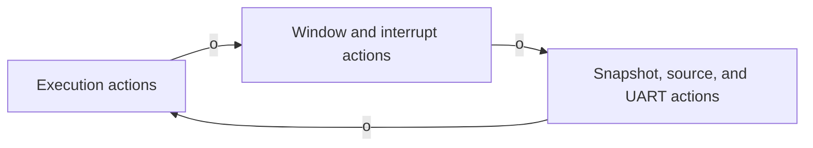
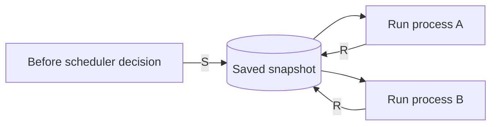
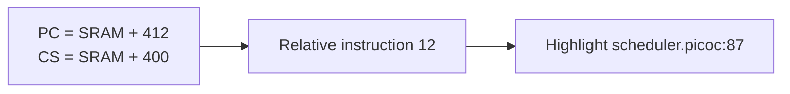
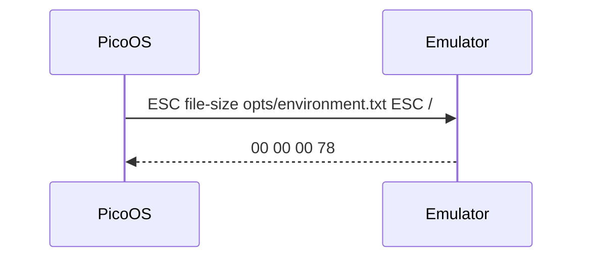
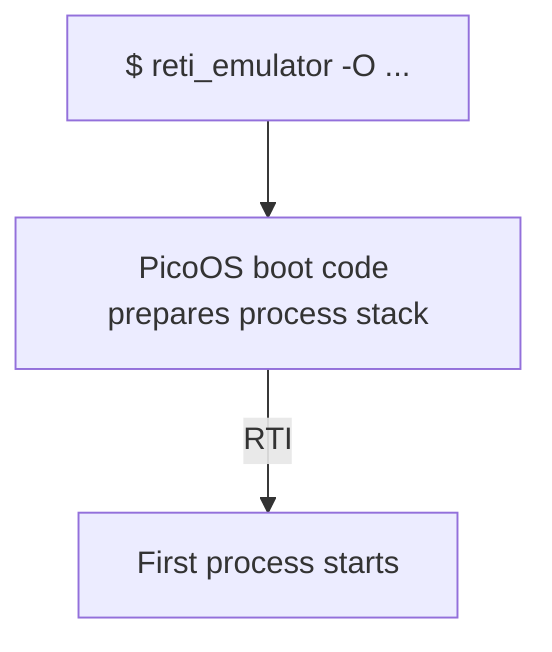
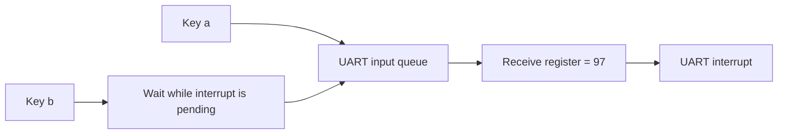
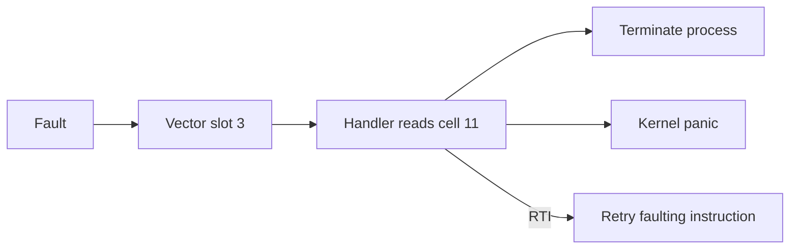

# New RETI emulator features relevant to PicoOS

This document covers user-visible features introduced from commit
`b5d4855e50cd5220b1f594162cb823ed8bb791ba` through the current revision. The
sections are ordered by the commit that first introduced each feature. Later
commits are folded into the description when they extended or changed a feature
that still exists. Pure bug fixes, tests, refactoring, documentation-only work,
and features that were later removed are intentionally omitted.

## Non-debug execution with standard terminal output

The emulator can run without the ncurses debugger; completed UART sends appear
as raw bytes on `stdout`:

```bash
$ reti_emulator pico_os.reti > pico_os_output.txt
```

This makes ordinary PicoOS runs usable with shell redirection and pipelines.
The debugger interface is initialized only when `-d` is requested.

Relevant commits: `fecea71daa17e35e775f063776cd67a7fd1f16eb`

## Assembly comments in the debug TUI

Given this generated assembly:

```reti
# Enter the scheduler
INT 2
LOADI ACC 0  # Child return value
```

`$ reti_emulator -d -c pico_os.reti` shows the comments beside the corresponding
instructions in the TUI. Leading comments appear before an instruction and
end-of-line comments after it. Long comments wrap without moving the watched
instruction out of the center of its window.

For PicoOS, this makes compiler annotations, section labels, syscall names, and
ISR descriptions visible while stepping through the generated assembly instead
of requiring a second source view.

Relevant commits: `123d82437dc2b5d19e9a28152fddd7ff5289de9c`,
`b7c2d18cc8015a4eef0763c72371a5610caf748e`,
`ec7257af99484c9abd587ee6ec859a3fbb60f1d1`

## Atomic test-and-set instruction

The RETI instruction set now includes `TSL S D i`, an atomic test-and-set:

```reti
# Before: M[DS + 0] = 0
TSL DS ACC 0
# After:  ACC = 0, M[DS + 0] = 1
```

If the lock was already held, `ACC` receives `1` instead. PicoOS can therefore
acquire a lock without a race between a separate load and store. The assembler,
disassembler, interpreter, and debugger all understand the instruction.

Relevant commits: `84674784c3a27b7c76450265ea717673631ee10a`,
`159cbc29ecac55bf97c3ed659ed489c76f3f9569`

## Paged debugger action help

The debugger infobox has three action pages that can be cycled with `o`:



The displayed actions change when the program is running continuously or has
halted.

This is particularly useful for PicoOS debugging because interrupt, terminal,
memory, and source-level controls remain available in one session without
overcrowding a single status line.

Relevant commits: `0659571edc575c5876f8ef1fbdf57c0e20da86c2`,
`6c587059bbc0a7a9a488ac9fb6d239f67c649106`

## Selectable manual ISR triggering

For example, to exercise vector slots `1` and `2` without waiting for hardware:

| Step | TUI display or input | Result |
| ---: | --- | --- |
| 1 | Infobox: `(T)rigger isr 1` | ISR `1` is selected |
| 2 | `T` | Run ISR `1` |
| 3 | `e` | Select ISR `2` |
| 4 | `T` | Run ISR `2` |

The selected ISR is shown on the second infobox page. Selection is independent
of the hardware-device mapping, and the TUI reports when no ISR is available.

PicoOS developers can therefore test individual interrupt paths and nested
interrupt behavior without waiting for a timer event or supplying UART input.
The earlier “keypress interrupt” name has become the current `CUSTOM` interrupt
terminology.

Relevant commits: `0659571edc575c5876f8ef1fbdf57c0e20da86c2`,
`c3d972acd3568790b6521d3d704dabbe857d4963`,
`6c587059bbc0a7a9a488ac9fb6d239f67c649106`

## Post-halt debugging and restart

```bash
$ reti_emulator -d -K pico_os.reti
```

After PicoOS reaches its terminating `JUMP 0`, the TUI remains open. The final
registers, SRAM, EPROM, peripheral state, source view, and captured terminal
output can still be inspected. Pressing `r` repeats the same invocation;
pressing `q` closes it.

For PicoOS this preserves the final machine state after shutdown, a panic, or a
small diagnostic program, and makes repeated boot attempts possible without
retyping the full command line.

Relevant commits: `9baa8c56e7b9e7fc9b9ee6215160cf29933ad3ef`,
`8524a9957944bbc99163cc1229e5084d48b7e79b`

## Repeatable debugger snapshots and restores

Capital `S` saves the current emulator state and capital `R` returns to it:



Restoring does not consume the snapshot, so a PicoOS syscall, interrupt, or
scheduler transition can be replayed repeatedly from the same pre-event state.

Relevant commits: `a1794aa0a2aa23116b613822ecc410e285df4e84`,
`9a3c626b5b0b5399cc459f02f3f167055fa42ce5`

## Unambiguous character input in debugger prompts

Value prompts distinguish numbers from characters:

| Input | Written value |
| --- | ---: |
| `1` | `1` |
| `'1'` | `49` |
| `'\n'` | `10` |
| `'\t'` | `9` |
| `'\\'` | `92` |

A single printable non-digit character can also be entered directly.

This is useful when changing PicoOS registers or memory through the debugger:
ASCII command characters, delimiters, and control characters can be entered
without manually looking up their numeric codes.

Relevant commits: `2a4d1e6c05447439966cf4e3830a6a1a63f29fac`

## PicoC source-level debugging and symbol annotations

Pressing `d` connects the RETI state to compiler debug metadata:



The source view uses `<program>.debuginfo`, or the path supplied with `-D`. When
a matching `.pre` file exists, it is displayed so the highlighted line matches
the compiler's preprocessed input.

The same metadata turns otherwise anonymous SRAM rows into labels such as:

| SRAM address | Value | Debug label |
| ---: | ---: | --- |
| `8012` | `3` | `global current_pid@12` |
| `8179` | `42` | `var timeslice@0` |
| `8182` | `9001` | `return addr.` |
| `8183` | `7` | `arg next_pid@0` |

Labels follow the active function frame and identify globals, locals,
arguments, the saved frame pointer, and the return address.

For PicoOS, this connects kernel and process behavior back to PicoC while still
showing the exact RETI registers and memory. It is especially valuable for
following syscall implementations, scheduler calls, stack frames, and global
kernel state through generated assembly.

Relevant commits: `f45057d087db0bdf524f13cd322ff932381047e3`,
`6340da7250737ed48354e758afc387c89d6d2338`,
`f14b0286685d155ccc42f219f6e92818d6fe9360`,
`e94feb18a1cf51b69714deb58238aee62b38e6a2`,
`edb979b6d406e13e9206c0ca9aff18876d4cc914`,
`94d39ce5d801efa79eb926bca7b52eb414f442e7`

## Selectable and scrollable debugger windows

The selected TUI window is visually marked. Its main navigation keys are:

| Keys | Result |
| --- | --- |
| `Tab` / `Shift-Tab` | Select next or previous window |
| `j` / `k` | Scroll the selected address window without changing its watchobject |
| `C` | Recenter on the watchobject |
| `J` / `K` | Increase or decrease the watched address or register value |
| `a` | Assign a new register or address to the selected window |

These controls let a PicoOS developer explore code, data, stacks, and the EPROM
boot path while preserving useful register-relative views. Incrementing a
register-backed watchobject is also a convenient way to walk a process stack or
kernel data structure.

Relevant commits: `7551a255ffa37ba7f6d3450c58fc029dadd83c12`,
`40504c940912580e43c07446a40054f3ed193ba7`,
`0fe8a3c628e5faa104a0ea2c1262fed5c9913715`

## Full-row watchobject highlighting

The watched cell is visually distinct from surrounding context:

| Watched | SRAM address | Value | Debug label |
| :---: | ---: | ---: | --- |
|  | `8178` | `0` | `saved frame pointer` |
| **Yes** | **`8179`** | **`42`** | **`var timeslice@0`** |
|  | `8180` | `3` | `var state@1` |

The highlight covers the full window width and every continuation row if the
rendered text wraps.

For PicoOS debugging, the highlight helps track the current instruction,
stack pointer, data pointer, or a manually chosen kernel structure even when
symbol annotations or long values occupy more than one line.

Relevant commits: `107bd8b72a6d9def684c5a946e48b182f96b04e8`,
`1c63bcfd215e63f4daaa15b5f4a81b22fb430ce1`

## Live register and memory editing

Capital `A` changes emulator state without restarting. For example:

| Goal | TUI input sequence |
| --- | --- |
| Set `ACC` to `0` | Select **Registers**, then enter `A`, `ACC`, `0` |
| Set SRAM cell `8179` to `42` | Select **Stack**, then enter `a`, address `8179`, `A`, `42` |

The first action changes a register; the second assigns a stack watchobject and
writes its cell. Register and memory inputs cover `-2147483648` through
`4294967295` and the character forms above. EPROM and SRAM writes are restricted
to valid loaded cells.

This makes it possible to patch PicoOS state during a debugging session—for
example, to change a saved return value, repair a stack entry, alter a flag, or
place execution at a different address—and immediately observe the result.

Relevant commits: `3632cc62391460c3a708841dbc1f785a7ca6ef5c`

## Raw numeric and ASCII words in `.reti` programs

A `.reti` file may mix instructions and literal memory words:

```reti
# Vector table
2
4

# ISR 0
LOADI ACC 42
RTI

# ISR 1
LOADI ACC 7
RTI

# Data
-1
4294967295
'O'
'S'
```

The numbers and quoted ASCII characters are loaded directly instead of being
assembled as instructions.

This lets the PicoC compiler emit one self-contained SRAM image containing the
interrupt vector table, code, global data, strings, and other initialized data.
It is also the basis for raw ISR vector addresses and for binary assembly of a
complete PicoOS image.

Relevant commits: `e94feb18a1cf51b69714deb58238aee62b38e6a2`,
`5226204a96a00092406799a32175ecbc2cc1dabe`

## Structured program loading through `.sections` files

For a compiler output with this companion file:

```json
{
  "interrupt_service_routines_start": 4,
  "codesegment_start": 40,
  "datasegment_start": 180,
  "stack_start": 8000
}
```

the emulator interprets the SRAM-relative layout as:

| SRAM-relative range | Contents |
| --- | --- |
| `0..3` | Raw interrupt-vector entries |
| `4..39` | ISR instructions |
| `40..179` | Code instructions |
| `180..end` | Raw data words |

Without `-i`, the embedded vectors and ISRs are loaded. With `-i isrs.reti`,
the embedded interrupt range is omitted in favor of that file. `stack_start`
sets the initial `SP` in the autogenerated EPROM program; `-1` selects the
default end-of-SRAM stack. `-S` selects a non-default section file.

For PicoOS, a single compiler-produced image can now describe its boot layout
without command-line reconstruction. The debugger can distinguish vector
entries, ISR code, kernel/process code, and data even when an EPROM bootloader
populates SRAM at runtime.

Relevant commits: `705f75f3ab5f9298bd1e02128591569be132a69c`,
`667a7b66296e6659d1882d870aaaf31aac61e084`,
`e5bc8937da386b348f52ff97cdd9b4e46894c4d8`,
`edb979b6d406e13e9206c0ca9aff18876d4cc914`,
`fefca7a06af4cf0fbfa2c0d279cbcf9456331f81`

## Memory-mapped, priority-aware interrupt controller

Hardware interrupt routing is visible and writable through these periphery
cells:

| Cell | Meaning |
| ---: | --- |
| `3` | Timer signal line → ISR slot |
| `4` | Custom signal line → ISR slot |
| `5` | UART signal line → ISR slot |
| `6` | Timer priority |
| `7` | Custom priority |
| `8` | UART priority |

For example, values `3=1`, `5=2`, `6=1`, and `8=3` route timer events to ISR
`1`, UART events to ISR `2`, and allow the higher-priority UART handler to
preempt the timer handler. Writing `255` to a mapping cell disables that signal
line.

The vector table itself contains raw SRAM-relative ISR addresses. A startup
configuration can express the same routing as:

```conf
-
1 INTTIMER
3 UART
```

Here the first line is the unused ISR `0` entry, followed by timer on ISR `1`
and UART on ISR `2`. The file can be loaded with `-C interrupts.conf`. PicoOS
can replace these mappings at runtime. The debugger's Interrupts page shows the
live values.

This gives PicoOS direct control over which handlers service timer, custom, and
UART events and over their preemption order, rather than baking device metadata
into assembly-only vector declarations.

Relevant commits: `6fbba4cc91f94bd1e8b7f4a1974c5d8925170c5c`,
`c3d972acd3568790b6521d3d704dabbe857d4963`,
`26b5be252297e5c1d790f52af7b3b0209d5ffd8e`,
`e8b8529179053078f58e508421048f8f44f7d42e`

## Raw-byte UART protocol and buffered input

UART registers are memory-mapped as follows:

| Cell | Register | Important status |
| ---: | --- | --- |
| `0` | Send byte | Clear status `b0` to start sending |
| `1` | Received byte | Read after status `b1` becomes set |
| `2` | Status | `b0` = send ready, `b1` = receive ready |

A string is sent as its bytes, with no emulator-added type or length field:

| PicoOS byte | Terminal output |
| ---: | --- |
| `0x4F` | `O` |
| `0x53` | `S` |
| `0x0A` | Newline |

PicoOS therefore defines any higher-level number or string framing itself.

Input is buffered and consumed one byte at a time. `-m` can seed the buffer from
the `# input:` metadata comment, including spaces after the first separator.
When no terminal view is supplying individual keystrokes, the emulator can ask
for another line of UART input; `\n` and `\t` escapes are accepted and an empty
line supplies a newline. Configurable simulated send and receive delays remain
available through `-w`.

Relevant commits: `b68c0c972521393e3327a2c4b5b87b58039f3911`,
`8906fb137cb0006b2486f537806ec085c71ad8c5`

## Binary assembly with a PicoOS loader header

```bash
$ reti_emulator --assemble shell.reti
```

The command writes `shell.bin` and exits. The output begins with five 32-bit
words from `shell.sections`:

| Word in `shell.bin` | Contents |
| ---: | --- |
| `0` | `codesegment_start` |
| `1` | `datasegment_start` |
| `2` | `heap_start` |
| `3` | `heap_size` |
| `4` | `stack_start` |
| `5` onward | Assembled SRAM words |

Assemble mode uses the normal loader, so raw words, embedded ISR handling, and
section boundaries are reflected in the image.

`heap_size: -1` asks the receiving loader to choose its default; any other value
requests that many heap words. `interrupt_service_routines_start` remains
debugging metadata and is not part of the binary header. This produces a
compact PicoOS/loadable-program format in which the loader receives both the
machine words and the memory-layout values needed to initialize a process.

Relevant commits: `27807a3a98326e1ad94bc6b2dd01f7f9f6fdb1da`,
`229d8cf07424464f0c9472eeab28c426fa11583f`,
`956317419a385436c6e8390bd75d67241a42a8f7`,
`a80a694141407f8928de05d2720d0350e6f407fb`

## EPROM-only startup for real bootloader flows

A bootloader can now be the only initial program:

```bash
$ reti_emulator -e pico_os_bootloader.reti
```

No positional SRAM `.reti` file is required. The EPROM program can load the
interrupt vector table, code, data, and other SRAM state at runtime, while the
interrupt controller is still initialized normally.

When debugging, a same-basename EPROM `.sections` file can describe the SRAM
layout that the bootloader will create. Without that metadata the SRAM is still
visible as raw values. This allows PicoOS to exercise its actual boot and binary
loading path instead of relying on the emulator to preload the kernel image.

Relevant commits: `880f4e7fde5790ac777fd2166544305cef98524a`,
`e5bc8937da386b348f52ff97cdd9b4e46894c4d8`

## UART host-service control frames

PicoOS requests host services with an escape-delimited UART frame. For example:



The response says the file contains `120` bytes. The command frame is consumed
and is not printed. Relative paths use the emulator's working directory.

The currently supported services are:

- `load <path>` returns a big-endian 32-bit word count followed by the binary
  file contents, which is suitable for loading assembled program images; for a
  40-byte file the response starts with `[00 00 00 0A]`
- `read <path>` returns a big-endian byte count followed by the entire regular
  file, or `UINT32_MAX` on failure
- `read-range <offset> <count> <path>` returns the number of bytes actually
  read followed by at most `count` bytes from the requested offset; for
  `read-range 4 3 file.txt`, a successful three-byte response is
  `[00 00 00 03][three data bytes]`
- `file-size <path>` returns the regular file's byte size, or `UINT32_MAX` on
  failure; PicoOS can use this for existence checks and `SEEK_END` without
  transferring file contents
- `!<command>` runs a host shell command in the emulator's working directory
- `write <path>` creates or truncates a host file and routes later UART output
  to it, while `append <path>` routes output to the end of a file
- `write stdout` and `write stderr` switch subsequent output back to the named
  standard stream

Together these operations provide the current emulator-side bridge used by
PicoOS for program loading, host-backed file access, output redirection, and
launching host commands.

Relevant commits: `6767f10aeebe7038eac1b868758b5e03ca84eb5e`,
`677fb68923986235fc3b3f9156bfb3cf3e75d2e1`,
`f14fa5aa3487d44c32061e09efbfabea2d0ee95c`,
`ed8b9c00c3a41f19233cc2224198bfa53354bd57`,
`e8b8529179053078f58e508421048f8f44f7d42e`,
`7efd9461b572264eea6b2921d03ecb171d474dac`,
`c277a56f73d9fd4f1461673816ce98aca3674a5b`

## Explicit companion-metadata paths

Build artifacts no longer need to share a basename or directory:

```bash
$ reti_emulator -S build/layout/kernel.sections \
                -D build/debug/kernel.debuginfo \
                build/asm/pico_os.reti
```

Without `-S` or `-D`, same-basename discovery remains unchanged.

This lets PicoOS builds keep generated assembly, boot images, section metadata,
and debug metadata in different build directories or use renamed artifacts
without copying them beside the `.reti` file.

Relevant commits: `edb979b6d406e13e9206c0ca9aff18876d4cc914`

## Runtime-aware SRAM code and data visualization

After a process switch, the debugger follows the new segment registers:

| State | `CS` | `DS` | Range shown as code |
| --- | --- | --- | --- |
| Before switch | `SRAM+40` | `SRAM+180` | `40..179` |
| After switch | `SRAM+600` | `SRAM+740` | `600..739` |

A static ISR range can additionally be supplied through
`interrupt_service_routines_start`. Vector entries and data stay numeric; an
invalid word inside a code range is also shown numerically instead of
terminating the emulator.

For PicoOS, code and data remain correctly presented across process switches or
runtime loading, where `CS` and `DS` may refer to a layout different from the
original kernel image.

Relevant commits: `fefca7a06af4cf0fbfa2c0d279cbcf9456331f81`

## Runtime-configurable timer interval and live counter

Periphery cell `9` is the live timer interval:

| Value in cell `9` | Effect |
| ---: | --- |
| `0` | Timer disabled |
| `100` | Interrupt every 100 executed instructions |
| `20` | Timer interval set to 20 instructions |

`-I <interval>` supplies the initial value; PicoOS can overwrite the cell while
running to start, stop, or retune scheduler ticks.

The debugger's Interrupts page also shows the current timer counter alongside
the device mappings. This makes scheduler-tick configuration observable and
lets PicoOS change its time-slice frequency without restarting the emulator.

Relevant commits: `d055d062c6f5c6647f0dba48c5d369b109f58eef`,
`2be5e8b80899fdaba93f90870a1e5a252e4ae7c4`,
`e8b8529179053078f58e508421048f8f44f7d42e`

## SRAM display transcoding

Pressing lowercase `t` changes how the same SRAM word is read:

| View | Displayed value |
| --- | --- |
| Numeric | `79` |
| ASCII | `'O'` |
| Instruction | `79` if the word is not a valid instruction |

Known code and ISR ranges stay decoded as instructions in every mode. ASCII
control bytes are shown by recognizable names.

This allows the same PicoOS memory to be examined as raw state, dynamically
loaded code, or text without changing the program or opening a separate tool.
Capital `T` remains reserved for manually triggering the selected ISR.

Relevant commits: `6c587059bbc0a7a9a488ac9fb6d239f67c649106`,
`43f6659e39fb320347430628664ce27ae8691c12`

## Synthetic initial ISR context for PicoOS startup

`-O` models the initial kernel as an active interrupt context:



The first `RTI` is therefore treated as leaving the synthetic OS context even
though no real interrupt entered the kernel first.

Relevant commits: `f2a0c866e8354b468a97f444c5e821ca01df68af`

## Interactive UART terminal and UART receive interrupts

In a normal run, terminal input follows this path:



The invoking terminal is activated automatically; no separate UART option is
needed.

Debug-terminal behavior depends on how `V` is opened:

| Debug state | What `V` shows | Does PicoOS run? | Is keyboard input delivered? |
| --- | --- | --- | --- |
| Paused | Captured UART output | No | No |
| Continuous execution (`c`) | Captured output, then live output | Yes | Yes |

By default, the capture is stored in `.reti_emulaor/terminal_output.bin` below
the working directory. With `-f <directory>`, that directory becomes the parent
instead. `Escape` returns to the TUI without being delivered to PicoOS; capital
`E` stops continuous execution at the current address.

This supplies the interactive console needed by the PicoOS shell while keeping
UART output from corrupting the debugger display and preserving the full
console transcript for inspection after a pause or halt.

Relevant commits: `5c268276d1b933ee2c5538235c2823ea555ce466`,
`e8b8529179053078f58e508421048f8f44f7d42e`,
`4024ab0e880988989699c21a1073afeb2fe87ea5`,
`d62466789178ac40abb76d09629e575f5eecb212`

## Synchronous CPU exceptions for process protection

The emulator exposes three synchronous exception causes:

| Cause register value | Fault |
| ---: | --- |
| `1` | Division or modulo by zero |
| `2` | Stack overflow |
| `3` | Illegal instruction |

All three enter fixed vector slot `3`; they do not use the hardware-device
priority mappings. The faulting instruction makes no partial register or memory
change.

Periphery cell `11` holds the cause. Cell `10` is the inclusive stack/heap
boundary for the current context:

| Cell `10` | `SP` change | Result |
| ---: | --- | --- |
| `5000` | `5001` to `5000` | Allowed |
| `5000` | `5000` to `4999` | Stack-overflow exception |
| `0` | Any | Protection disabled |

PicoOS must update cell `10` when switching between the kernel and processes
with different heap limits.



If vector slot `3` has not been declared, the exception is reported as
unhandled and execution stops. The debugger's Exceptions page shows cells `10`
and `11`.

Relevant commits: `ba21dfd76699d0ebd8978fbef9170af0ae3f9a79`

## Explicit interrupt-vector count for bootloaded tables

For an EPROM bootloader that creates four vector entries at runtime:

```bash
$ reti_emulator -n 4 -e pico_os_bootloader.reti
```

`-n <count>` and `--isr-count <count>` accept `0` through `255` and override the
detected vector count after all program files are loaded. The emulator therefore
does not need to see the bootloaded table in the initial input files.

This matters for PicoOS exceptions because slot `3` is considered available
only when at least four entries are declared.

Relevant commits: `bae844441ffcd4ea5280e71cf48545f3898bba45`
